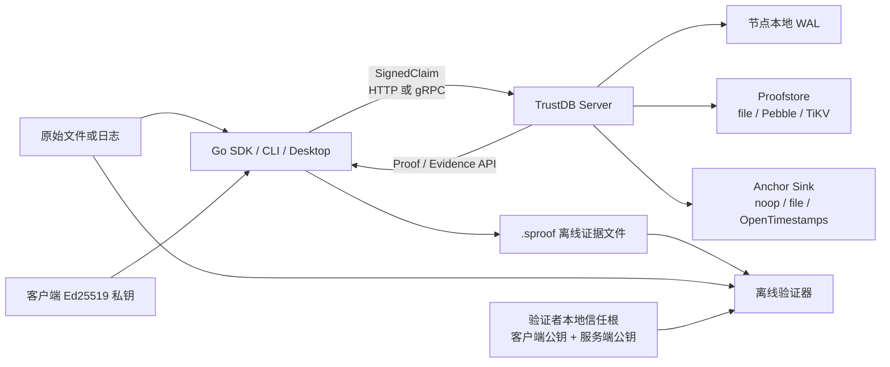
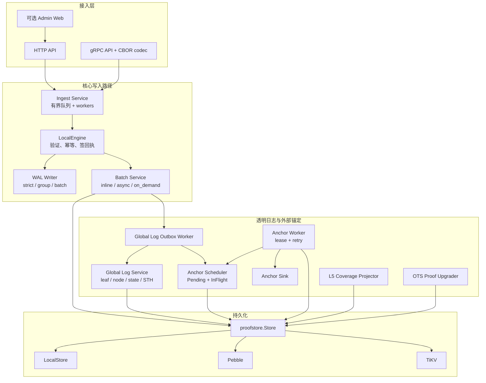
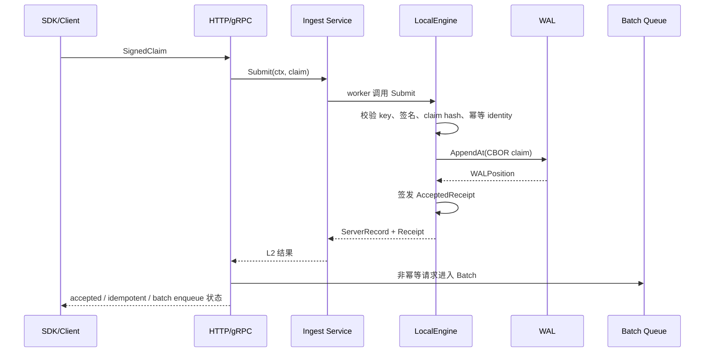
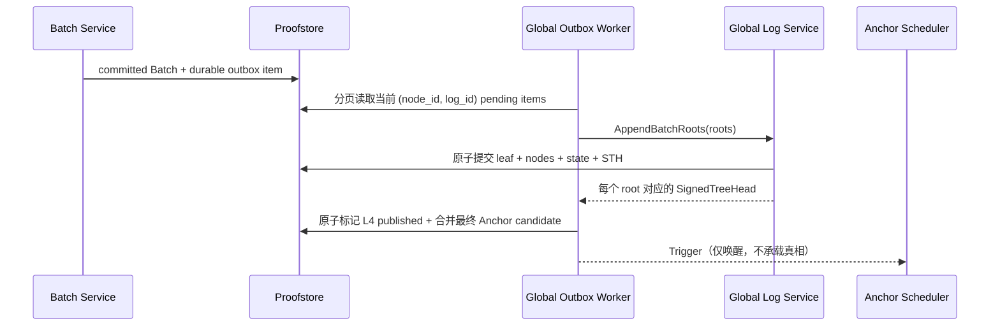
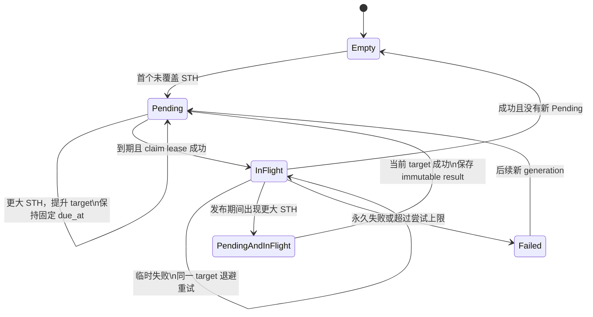
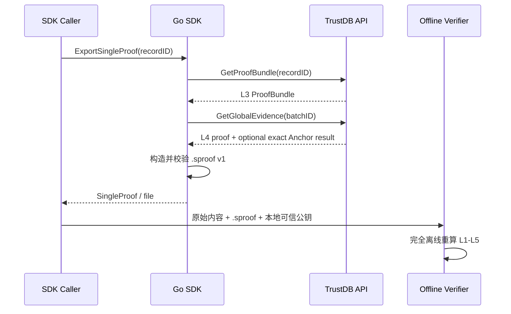
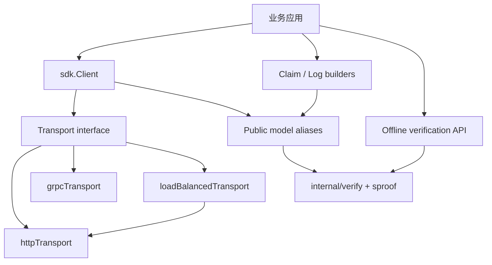
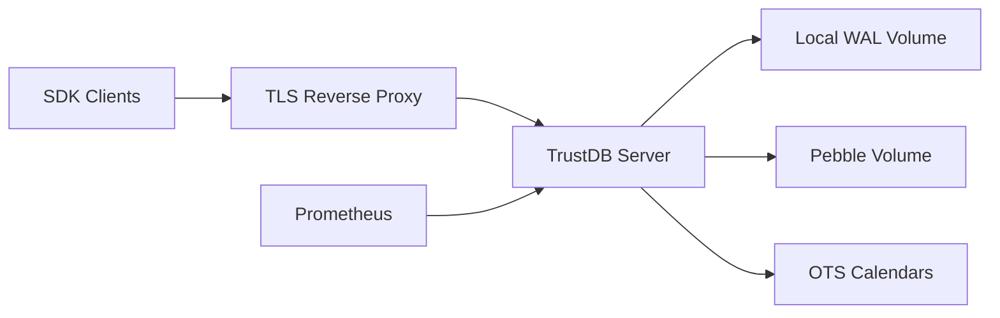
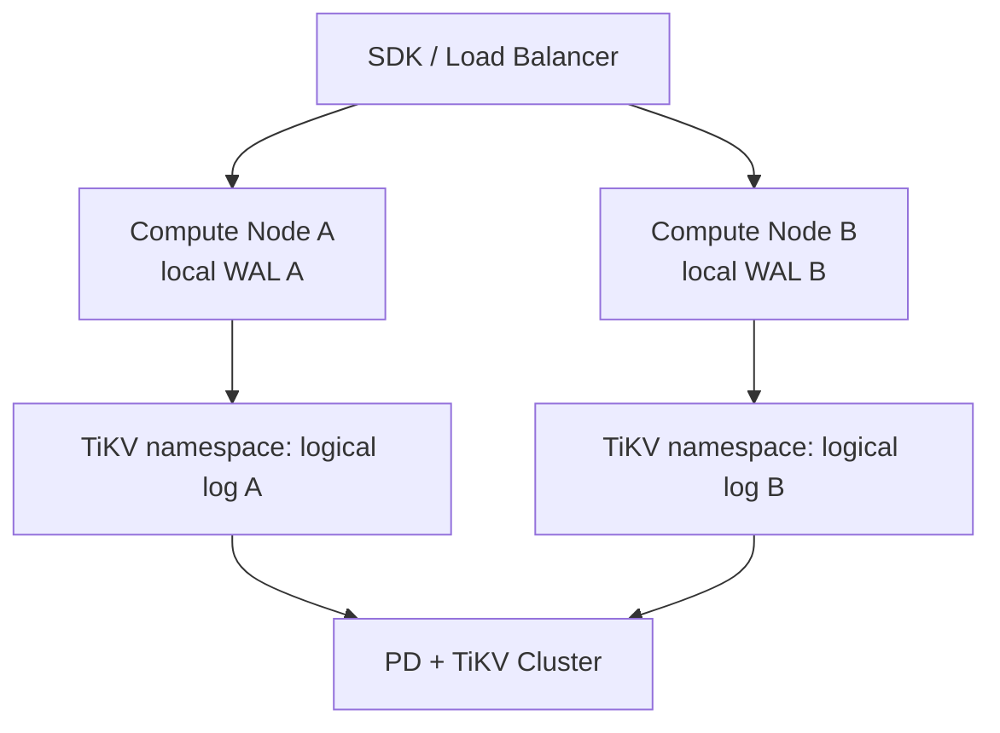

# TrustDB 与 Go SDK 架构设计

> 状态：与当前实现同步的架构说明
>
> 适用范围：TrustDB Server/CLI、Go SDK、proofstore、Global Log、STH Anchor、离线证明与逻辑备份
>
> 不包含：官网部署、Admin Web 视觉设计、桌面客户端内部 UI 架构

## 1. 阅读指南

如果你第一次接触 TrustDB，建议按下面顺序阅读：

1. 先看“系统解决什么问题”和“L1–L5 证明语义”。
2. 再看“总体组件图”和“一条记录的完整生命周期”。
3. 服务端开发者继续看持久化、恢复、Global Log 与 Anchor。
4. SDK 使用者可以直接跳到“Go SDK 架构”和“离线验证信任边界”。
5. 运维人员重点阅读存储后端、启动恢复、关闭顺序、备份恢复和可观测性。

本文描述当前代码已经实现的行为。未来方向会明确标为“演进方向”，不能视为当前保证。格式层的稳定约束另见 [`formats/SPROOF_V1.md`](formats/SPROOF_V1.md)，分布式部署边界另见 [`formats/DISTRIBUTED_ARCHITECTURE.md`](formats/DISTRIBUTED_ARCHITECTURE.md)。

## 2. 系统解决什么问题

TrustDB 不是把文件本身写入数据库，而是保存“内容声明及其可验证证据”。客户端先对内容求哈希并签名；服务端再依次给出接受、批次提交、透明日志包含和外部锚定证据。

系统希望回答五个逐层增强的问题：

1. 谁声明了这份内容？
2. TrustDB 服务端是否已经接受这条声明？
3. 这条声明是否进入一个不可随意改写的 Merkle 批次？
4. 这个批次是否进入持续增长的 Global Transparency Log？
5. 某个覆盖该批次的 Signed Tree Head 是否已经由外部锚定系统接受？

TrustDB 的关键设计不是一个单一的“已保存”状态，而是多个彼此独立、可以验证、可以恢复的耐久边界。

## 3. 设计目标与非目标

### 3.1 设计目标

- 证据可独立验证：验证器不信任服务端返回的等级标签，而是重新计算哈希、签名和 Merkle path。
- 接受路径有明确耐久边界：L2 回执与 WAL 写入及配置的 fsync 策略绑定。
- 后台处理可恢复：Batch、Global Log、Anchor 和 L5 投影都能在重启后继续。
- 重试幂等：相同 idempotency identity 不应产生不同的接受结果；已完成的外部 Anchor 不应被重复结果破坏。
- 大数据路径有界：队列、分页、批处理和投影均有界；证明生成不依赖扫描全部历史。
- 存储实现可替换：file、Pebble 和 TiKV 实现统一的 `proofstore.Store` 语义契约。
- 传输不改变语义：HTTP 与 gRPC 共享相同的确定性 CBOR 模型和错误语义。
- 证据可离线交换：`.sproof` 文件包含验证所需证据，但不把文件自带公钥当成信任根。

### 3.2 当前非目标

- 不保存或分发原始文件内容。
- 不提供跨所有节点的单一全局日志。
- 不支持同一 proofstore namespace 下的多写者 active-active Global Log。
- 不把消息队列当作 Global Log 顺序或提交真相来源。
- 不把 L5 record index 投影当作 L5 证明本身。
- 不自动兼容或双读旧 proofstore schema；不匹配时明确失败。
- 不由服务端提供节点发现或集群级统一查询目录；多 endpoint 由 SDK/客户端管理。

## 4. L1–L5 证明语义

| 等级 | 事实 | 权威证据 | 不能推出的事实 |
| --- | --- | --- | --- |
| L1 | 客户端对包含内容哈希和元数据的声明签名 | `SignedClaim` | 服务端已经接收 |
| L2 | 服务端验证声明并写入 WAL，签发接受回执 | `ServerRecord` + `AcceptedReceipt` | 已经生成 Batch Merkle proof |
| L3 | 记录进入已提交的 Batch Merkle tree | `ProofBundle` + `CommittedReceipt` + `BatchProof` | Batch 已进入 Global Log |
| L4 | Batch root 是某个 Signed Tree Head 覆盖的 Global Log leaf | `GlobalLogProof` + `SignedTreeHead` | 该 STH 已被外部系统锚定 |
| L5 | 与 L4 精确匹配的 STH/root 已获得 sink-specific anchor 结果 | `STHAnchorResult` | 更早的 STH 曾在当时单独锚定 |

后续 STH 在密码学上覆盖此前所有 Global Log leaf。因此，L5 证据可以直接证明一个较早 Batch 属于一个较新的已锚定 STH。实现会针对这个后续 STH 重新生成 inclusion path，并要求 Anchor 的 `tree_size`、`root_hash`、`node_id`、`log_id` 与该 STH 精确匹配。

这不等于放宽验证规则。验证器禁止只因为 `anchor.tree_size >= proof.tree_size` 就套用 Anchor；证据文件中 L4 proof 所引用的 STH 必须就是被 Anchor 精确绑定的 STH。

## 5. 系统上下文

主要信任角色：

- 客户端私钥负责 L1 身份声明。
- 服务端私钥负责 L2/L3 回执和 Global Log STH 签名。
- proofstore 保存服务端产生的持久证据与调度状态，但验证者仍会检查密码学绑定。
- Anchor sink 给出外部锚定材料；不同 sink 的证明强度和解释不同。
- 验证者本地提供的公钥才是 trust roots。证据文件内即使包含公钥，也不能自动建立信任。

## 6. 总体组件架构

### 6.1 组件职责

| 组件 | 主要职责 | 不负责 |
| --- | --- | --- |
| `sdk` | 内容哈希、claim 签名、传输调用、批量/流式提交、故障转移、证据导出、离线验证 | 保存服务端权威状态 |
| `httpapi` / `grpcapi` | 参数与大小边界、传输编码、错误映射、分页 envelope | 改变证明语义 |
| `ingest.Service` | 有界接入队列、并发 worker、背压、关闭排空 | Batch 持久化 |
| `app.LocalEngine` | 客户端签名验证、key 状态、record ID、幂等、WAL append、L2 回执签名 | Global Log 或 Anchor |
| `wal.Writer` | hash-chained WAL record、segment、fsync、检查、修复和裁剪基础能力 | 判断 Batch 是否已经完整提交 |
| `batch.Service` | 聚合记录、Merkle tree、manifest 状态、L3 materialization、checkpoint frontier | 外部锚定 |
| `proofstore.Store` | Proof、索引、Batch、Global Log、Anchor 调度与结果的统一持久化契约 | 网络入口 |
| `globallog.OutboxWorker` | 从持久 outbox 取 Batch root、批量追加 Global Log、失败重排 | 把外部 provider 当作事务一部分 |
| `globallog.Service` | append-only Global Log、STH、inclusion/consistency proof、覆盖型 evidence | 外部 Anchor 发布 |
| `anchor.Service` | O(1) 调度读取、claim lease、固定目标重试、结果落库 | 扫描全部 STH |
| `l5projector.Service` | 把最新 Anchor 覆盖前缀异步投影为 record L5 展示状态 | 阻塞权威 L5 evidence 生成 |
| `backup` | 逻辑证据导出、完整性校验、可恢复 restore | 备份节点本地 WAL |
| `verify` | 完全离线重算证据链 | 信任服务端返回的 `proof_level` |

## 7. 一条记录的完整生命周期

### 7.1 客户端创建 L1

SDK 的 `BuildSignedFileClaim`、`BuildSignedLogClaim` 或 `BuildSignedJSONLogClaim` 执行以下工作：

1. 流式读取内容并计算配置的内容哈希。
2. 记录内容长度、媒体类型、存储 URI、事件类型和自定义元数据。
3. 生成确定性 CBOR claim 表达。
4. 使用客户端 Ed25519 私钥签名。
5. 返回 `SignedClaim`；此时最高等级为 L1。

服务端不需要接收原始文件，只接收声明及签名。离线验证时，验证者重新读取原始文件并计算相同哈希。

### 7.2 服务端接受并形成 L2

几个容易混淆的边界：

- L2 在 WAL append 和接受回执签发后成立，不要求 L3 已经完成。
- WAL 的崩溃耐久强度由 `wal.fsync_mode` 决定。
- Batch queue 是有界的。声明可能已经成为 L2，但随后的 Batch enqueue 因背压失败；返回结果会保留 `batch_enqueued` 和错误信息，WAL replay 仍可恢复这条接受记录。
- 相同 `(tenant_id, client_id, idempotency_key)` 与相同 claim 会返回原接受结果；相同 key 对应不同 claim 会失败关闭。
- 没有 idempotency key 时，确定性 `record_id` 仍用于阻止同一记录身份与不同声明发生冲突。

### 7.3 Batch 提交并形成 L3

Batch Service 按 `max_records` 或 `max_delay` 关闭当前批次。核心过程是：

1. 为批次创建/恢复 `BatchManifest`。
2. 基于 `ServerRecord` 构建 Batch Merkle tree。
3. 生成 `BatchRoot`、record index 和可选的树快照。
4. 为每条记录生成 `CommittedReceipt` 与 Merkle audit path。
5. 持久化 artifacts。
6. 将 manifest 单调推进到 committed。
7. 在后端支持时，原子发布 committed manifest 与幂等决策投影。
8. 推进连续 WAL checkpoint frontier，并在安全能力存在时裁剪旧 segment。

Proof 模式决定 L3 materialization 发生时间：

| 模式 | Batch 关闭时 | Proof 查询时 | 适用取舍 |
| --- | --- | --- | --- |
| `inline` | 同步生成完整 `ProofBundle` | 直接读取 | 最直观，提交 CPU 成本较高 |
| `async` | 先持久化 L2 index/root/tree，后台 materializer 分页生成 L3 | 未完成时可能暂不可用 | 提高写入吞吐，形成可观察 backlog |
| `on_demand` | 先持久化计划与树材料 | 第一次查询指定 record 时 materialize | 降低冷数据写放大，把成本移到读路径 |

Manifest 是恢复边界而不只是列表元数据。prepared、committed、failed 等状态用于判断 artifacts 是否可见、重启时应重放还是继续 materialize，以及 WAL checkpoint 是否能安全前进。

### 7.4 Batch root 进入 Global Log 并形成 L4

Batch commit 不直接同步等待 Global Log。它先把 `GlobalLogOutboxItem` 写入 proofstore，再由后台 worker 处理：

Global Log 使用 append-only Merkle tree：

- `GlobalLogLeaf` 绑定 Batch ID、Batch root、Batch tree size、关闭时间和来源身份。
- `GlobalLogNode` 保存可寻址的子树节点，避免为单个 proof 重建整棵树。
- `GlobalLogState` 保存 tree size 和 frontier。
- 每次追加产生由服务端 key 签名的 `SignedTreeHead`。
- inclusion proof 和 consistency proof 都从持久节点按树结构读取，目标复杂度为 `O(log N)`，而不是扫描全部 leaf。

Outbox 的 pending/retry 状态是持久的。进程退出或临时错误不会让已提交 Batch root 消失；worker 按退避时间重试。

### 7.5 STH 合并锚定并形成 L5

Anchor 调度状态按 `(NodeID, LogID, SinkName)` 隔离。每个 key 只保留：

- 最多一个可提升的 `Pending`；
- 最多一个不可替换的 `InFlight`；
- 不可变的成功 `STHAnchorResult` 历史；
- 一个 O(1) latest-result 引用。

第一个未覆盖 STH 打开固定、非滑动窗口。窗口内后续 STH 只把 Pending target 提升到更大的 `TreeSize`，不会延后原 deadline。Global Log worker 每批只把最后、最大的 STH 作为 Anchor candidate，因此单个 128-root Global Log 发布批次不会制造 128 个外部提交任务。

重要不变量：

- 一旦目标可能产生外部副作用，它就成为 immutable InFlight，后续 STH 不能替换它。
- 失败重试始终提交相同 STH，避免“一次尝试、多个密码学目标”。
- generation、lease token 和 CAS/事务防止陈旧 worker 覆盖新状态。
- 成功完成需要把精确 Anchor result、InFlight 清理和 latest 引用推进作为一个语义单元。
- 同一 `TreeSize` 出现不同 `RootHash` 属于数据冲突，必须失败关闭。
- 正常关闭不强制 Anchor；Pending 的固定 deadline 会持久化并在重启后恢复。

支持的 sink：

| Sink | 用途 | 验证说明 |
| --- | --- | --- |
| `off` | 关闭 L5 | 不运行 Anchor worker |
| `noop` | 开发和端到端流程测试 | 只能证明 TrustDB 流程完成，不提供外部时间可信度 |
| `file` | 本地/隔离环境的确定性落盘锚定 | 离线检查确定性 ID 与证据绑定 |
| `ots` | OpenTimestamps calendars | 保存 calendar 返回的原始 timestamp，并可后台升级为更完整证明 |

### 7.6 L5 coverage 投影

最新成功 Anchor 的 STH 覆盖所有 `LeafIndex < AnchoredTreeSize` 的 Batch。权威 evidence API 可以立即利用这个覆盖关系，不需要等待 record index 更新。

`l5projector.Service` 只是把这项事实异步物化到 record index：

1. O(1) 读取当前 schedule key 的最新 Anchor result。
2. 从连续 checkpoint 开始分页读取 Global Log leaf。
3. 幂等、单调地把对应 Batch 的 index 等级提升到 L5。
4. 整页处理成功后才推进 checkpoint。
5. 崩溃后从最后完整页继续；重复 promotion 不会降级数据。

因此必须区分：

- `GlobalLogEvidence + STHAnchorResult` 是权威 L5 证据。
- record index 的 `proof_level=L5` 是查询和展示用派生投影。
- 投影落后不会降低已存在证据的真实等级，也不会阻塞 `.sproof` 导出。

## 8. 证据查询、组合与离线验证

### 8.1 Global Evidence

`GlobalLogEvidence` 把 L4 与可用的 L5 组合在一次调用中：

1. 按 Batch ID O(1) 找到 Global Log leaf。
2. O(1) 读取配置 sink 的最新成功 Anchor result。
3. 如果 Anchor 的 STH 覆盖该 leaf，直接针对该 STH 生成 inclusion proof，并附上精确 Anchor result。
4. 如果没有 covering anchor，则针对最新 STH 生成 L4 proof，Anchor 为空。

这让 SDK 的 `ExportSingleProof` 通常只需两次服务调用：

1. 获取 L3 `ProofBundle`；
2. 获取组合的 `GlobalLogEvidence`。

### 8.2 `.sproof` 导出

当 Global Log 功能未启用或对应 evidence 暂不可用时，SDK 可以降级导出 L3 `.sproof`。其他数据损坏或非“不可用”错误不会被静默吞掉。

### 8.3 离线验证顺序

SDK 的 `VerifySingleProof`/`VerifyArtifacts` 最终调用统一 verifier：

1. 检查 `.sproof` schema、字段组合和大小边界。
2. 重新读取原始内容，校验长度和 content hash。
3. 用本地客户端公钥验证 `SignedClaim`。
4. 重算 record ID、claim hash、client signature hash。
5. 用本地服务端公钥验证 Accepted/Committed receipt。
6. 重算 Batch leaf 并验证 Batch Merkle path，得到 L3。
7. 验证 Global Log leaf 绑定、inclusion path 和 STH 签名，得到 L4。
8. 精确校验 Anchor 与同一 STH 的 tree size、root 和来源字段，并验证 sink-specific proof，得到 L5。
9. 输出重新计算的等级，不信任文件中的等级提示。

整个过程不访问 TrustDB、Anchor provider 或网络。`SkipAnchor` 只允许验证者主动把检查上限降到 L4，不会把不完整的 L5 当作成功。

## 9. 持久化模型与耐久边界

### 9.1 权威状态、调度状态与派生状态

| 类别 | 示例 | 恢复原则 |
| --- | --- | --- |
| 密码学权威数据 | `SignedClaim`、receipts、`ProofBundle`、Batch root、Global leaf/node/STH、Anchor result | 不允许凭派生标签替代；冲突失败关闭 |
| 工作流权威状态 | Batch manifest、Global outbox、Anchor Pending/InFlight、重试计数 | 重启后继续；状态转换需幂等 |
| 派生索引 | record secondary indexes、latest Anchor 引用、L5 coverage checkpoint、部分 idempotency projection | 可校验或重建；不得反向修改权威证据 |
| 节点本地恢复状态 | WAL segments、scoped WAL checkpoint | 必须与具体 node/WAL identity 绑定 |

### 9.2 四个主要耐久边界

| 边界 | 成功后系统可以声明 | 关键持久写入 | 失败恢复 |
| --- | --- | --- | --- |
| WAL accepted | L2 | WAL record；fsync 强度由模式决定 | 重放 WAL，重建接受对象与待 Batch 工作 |
| Batch committed | L3 | manifest、bundle/index/root/tree、幂等投影 | 根据 manifest 判断继续、跳过或失败关闭 |
| Global Log published | L4 | leaf、nodes、state、STH；outbox published marker | outbox 重试，append replay 校验相同身份与 root |
| Anchor completed | L5 | immutable result、清理 InFlight、latest 引用 | lease/generation 保证同一目标幂等完成 |

### 9.3 WAL fsync 模式

| 模式 | 返回 L2 前的文件同步行为 | 典型取舍 |
| --- | --- | --- |
| `strict` | 每条 append 等待 WAL file fsync | 最强逐条接受契约，吞吐最低 |
| `group` | 在 `group_commit_interval` 内合并 fsync | 有界 dirty window，生产默认平衡 |
| `batch` | 延后到 segment rotation 或 close | 吞吐优先，不适合要求逐条崩溃耐久的场景 |

无论 append 模式如何，WAL 目录创建、segment 发布、轮转和裁剪仍有独立的目录耐久屏障。底层平台无法提供所需目录同步时，代码选择失败关闭而不是静默声称成功。

### 9.4 WAL checkpoint 与裁剪

自动跳过 checkpoint 覆盖记录并裁剪旧 WAL segment，需要 proofstore 同时证明：

1. committed artifacts 已经耐久；
2. 重启幂等决策已经耐久并支持 point lookup；
3. checkpoint 明确属于当前 compute node 和本地 WAL identity；
4. checkpoint 推进与 manifest/幂等投影之间有防并发保护。

未实现完整能力的后端必须保留并重放 WAL。checkpoint 是恢复优化，不是删除历史的许可标记。

## 10. Proofstore 后端

所有后端都实现 `proofstore.Store`，并通过可选 capability interface 暴露批量 artifacts、幂等投影、Anchor schedule、L5 checkpoint 等增强能力。

| 维度 | LocalStore (`file`) | Pebble | TiKV |
| --- | --- | --- | --- |
| 定位 | 开发、小数据量、可人工查看目录 | 单节点生产默认 | 存算分离、共享集群持久化 |
| 事务机制 | 锁、临时文件、fsync、原子替换和 crash-safe journal | 单机原子 Batch + sync write | TiKV transaction + CAS/fencing |
| 并发读取 | 文件级实现 | 有序 KV，适合分页/范围查询 | 分布式有序 KV |
| Batch/Global append | 语义原子协议 | 同一 Pebble Batch | 同一 TiKV transaction |
| WAL prune safety | 当前固定为 false | 幂等投影 ready 后可启用 | 配置完整 node/WAL scope 且投影 ready 后可启用 |
| 适用限制 | 不建议生产大规模索引 | 单机数据库锁，同一路径只打开一次 | 同 namespace 多写者 Global Log active-active 不支持 |

### 10.1 Schema 与兼容策略

- file、Pebble 和每个 TiKV namespace 使用 proofstore schema v4。
- 空存储可以初始化 schema marker。
- 非空但无 marker、或 marker 版本不匹配时，启动明确失败。
- 当前实现不自动迁移、不双读旧 Anchor queue 布局。
- 升级时应使用受支持的新存储，或从当前逻辑备份恢复。

### 10.2 TiKV namespace 和身份

TiKV key 使用应用 namespace 前缀隔离。一个 namespace 对应一个逻辑 `(node_id, log_id)` Global Log stream：

- active-passive 替换节点只有在保持相同逻辑身份时才能接管 namespace。
- 独立日志、租户隔离或独立计算域应使用不同 namespace。
- 同一 namespace 的 active-active writer 需要额外 lease/fencing 设计，当前不支持。
- tree size、STH 和 Batch ID 的可比较范围始终受 `(node_id, log_id)` 约束。

## 11. Go SDK 架构

### 11.1 分层结构

SDK 公开类型大多是 `internal/model` 的别名，这保证 CLI、HTTP、gRPC、SDK 与离线验证共享同一 schema，而不是维护多套容易漂移的 DTO。

### 11.2 Transport 抽象

`sdk.Client` 依赖 `Transport` 接口，而不是直接依赖 HTTP：

- `NewClient` 创建 HTTP transport，默认 15 秒超时并优化连接池并发。
- `NewGRPCClient` 创建使用 TrustDB CBOR codec 的 gRPC transport；默认是 insecure credentials，生产调用方应显式传入 TLS credentials。
- `NewClientWithTransport` 允许测试或自定义传输。
- transport 返回统一 `sdk.Error`，保留操作、endpoint、状态码、TrustDB code 和底层错误。

HTTP 和 gRPC 支持相同的核心操作；gRPC 额外提供原生双向流式 claim 提交。HTTP batch 与 gRPC stream 的 item result 都保留输入顺序和单项错误，避免一个失败项丢失整批诊断。

### 11.3 日志批量和流式提交

SDK 在客户端侧并行构造/签名日志 claim，再通过支持的 transport 批量或流式提交：

- 构造失败和服务端失败按 item 返回。
- 结果索引对应原输入索引。
- context 取消会停止发送并关闭结果流。
- 有界 result buffer 和 transport 并发配置避免无限内存增长。
- 批量签名不会改变每条 claim 的独立签名与 record identity。

### 11.4 多 endpoint 与故障转移

`NewLoadBalancedClient` 支持：

- `round_robin`：每次操作轮换首选 endpoint；
- `failover`：固定从第一个 endpoint 开始；
- 两种模式都只对可重试的 transport/endpoint 错误尝试下一个 endpoint；
- 业务拒绝、格式错误、签名错误等非重试错误不会跨节点盲目重放。

多 endpoint 并不构成一个单一 Global Log。调用方仍需理解每个 endpoint 的 `node_id`、`log_id` 和 proofstore namespace 归属。

### 11.5 SDK 安全责任

- 私钥只用于本地构造签名，不应发送给服务端。
- SDK 不自动信任服务端返回的客户端/服务端公钥。
- TLS 配置属于 transport 信道安全；proof 验证属于证据安全，两者不能相互替代。
- SDK 的 failover 只处理可诊断的传输故障，不应把语义冲突隐藏成成功。
- `.sproof` 写文件使用格式校验；读取时有 schema 与大小限制。

## 12. HTTP、gRPC 与分页

HTTP 主要资源族：

- 健康：`/healthz`；
- 写入：`POST /v1/claims`、`POST /v1/claims/batch`；
- record/proof：`/v1/records`、`/v1/proofs/{record_id}`；
- Batch/tree：`/v1/roots`、`/v1/batches/...`；
- Global Log：`/v1/sth`、`/v1/global-log/leaves`、inclusion、evidence、consistency；
- Anchor：`/v1/anchors/sth`；
- 可观测性：`/metrics`。

列表接口使用有方向的 cursor pagination。cursor 包含稳定排序所需的复合位置，例如时间戳加 ID，或 Anchor 的 stream/sink/tree 组合键；实现不能通过先扫描全量数据再截断来伪装分页。

gRPC 服务覆盖健康、claim、双向流式 claim、record、proof、root、STH、Global evidence、Anchor 和 metrics。两种传输都使用同一服务对象，因此 transport 不应改变 L1–L5 语义。

## 13. 备份与恢复

### 13.1 `.tdbackup` 包含什么

逻辑备份分页导出并逐项记录大小与 SHA-256：

- Batch manifests；
- Proof bundles（恢复写入 bundle 时同步恢复 record index）；
- Batch roots；
- Global Log leaves、nodes、state、STHs 和 tiles；
- Global Log outbox 的 pending/published/retry 状态；
- immutable Anchor results；
- Anchor Pending/InFlight schedule 及幂等重试信息。

### 13.2 不包含什么

- 节点本地 WAL segment；
- 节点本地 WAL checkpoint；
- latest Anchor 引用等可重建快捷索引；
- L5 coverage checkpoint 等派生投影进度；
- 原始文件内容和私钥。

### 13.3 Restore 流程

1. 先完整 Verify archive schema、entry metadata、hash 和结尾结构。
2. 按 archive ordinal 幂等写回各类对象。
3. restore checkpoint 记录最后成功 ordinal，支持中断后继续。
4. 恢复 Anchor schedule 时清除旧进程 lease ownership，防止把已失效 worker 当作活跃 owner。
5. 恢复后重建持久 idempotency projection。
6. latest Anchor 与 L5 coverage 等派生状态在运行时重新建立。

备份恢复不会自动证明节点本地 WAL 已与恢复点一致。恢复后的服务应使用与该逻辑数据集相匹配的新 WAL/身份配置，不能把任意旧 WAL 与恢复 proofstore 混合启动。

## 14. 启动、恢复与关闭

### 14.1 启动顺序

当前 `trustdb serve` 大致按以下顺序组装：

1. 解析配置、key registry、服务端与客户端公钥。
2. 打开 WAL 并初始化 segment 指标。
3. 打开 proofstore，校验 schema，准备 durable idempotency projection。
4. 创建 LocalEngine、Ingest 和 Batch Service。
5. 创建 Anchor、L5 projector、Global Log 和 outbox worker。
6. 重放 WAL，校验 checkpoint、manifest、record index、proof bundle 与幂等决策的交叉绑定。
7. 启动 async proof materializer scan。
8. 回填缺失的 Global Log outbox，再启动 outbox。
9. 启动 Anchor worker、L5 projector 和可选 OTS upgrader。
10. 最后开放 HTTP/gRPC listener。

服务不会在恢复检查完成前对外宣称 ready。缺失 WAL 前缀、冲突 manifest、错误 checkpoint 边界、签名/record 不一致等情况会以 `DataLoss` 或 `FailedPrecondition` 失败关闭。

### 14.2 正常关闭

收到 SIGINT/SIGTERM 后：

1. 停止 HTTP 接收新请求并 graceful shutdown。
2. graceful stop gRPC。
3. 关闭 Ingest，等待已接收 worker 返回。
4. 关闭 Batch，排空或持久化其可恢复状态。
5. 后台 worker 通过 defer 顺序停止，再关闭 proofstore 与 WAL。

Anchor `Stop` 不强制提交 Pending；固定 deadline 和 Pending/InFlight 已持久化，重启后继续。这避免“每次维护关机都产生额外外部 Anchor”。

## 15. 故障模型

| 故障点 | 可见结果 | 重启/重试行为 |
| --- | --- | --- |
| claim 校验前失败 | 无 L2 | 客户端修正后重试 |
| WAL append 失败 | 不签发成功 L2 | 原请求失败，检查 WAL/磁盘 |
| L2 成功、Batch enqueue 失败 | L2 已成立，L3 尚未成立 | WAL replay 重新入 Batch |
| Batch artifacts 部分写入 | manifest 不应错误宣称 committed | 恢复根据 manifest 重试或失败关闭 |
| Batch committed、outbox 未处理 | L3 成立 | outbox worker 重试到 L4 |
| Global append 成功、published marker 未完成 | 持久 STH 可能存在，outbox 仍待处理 | replay 校验相同 leaf/STH 后补 marker |
| Anchor provider 临时失败 | L4 保持，L5 未完成 | 同一 InFlight target 退避重试 |
| provider 成功、结果落库前崩溃 | 外部副作用可能已发生 | immutable target 重试；sink/结果逻辑必须幂等 |
| L5 projector 中途失败 | 权威 L5 evidence 仍可用，索引可能部分提升 | 从连续 checkpoint 重做整页 |
| OTS proof 升级失败 | 原 Anchor result 保留 | 后台条件更新重试，不让 latest 引用倒退 |
| proofstore schema 不匹配 | 服务拒绝启动 | 重建或从当前格式备份恢复 |

## 16. 可观测性

`/metrics` 由独立 Prometheus registry 暴露。主要观察域包括：

- ingest 请求结果、拒绝原因和 queue depth；
- Batch 大小、关闭/提交延迟、materializer backlog；
- WAL append/fsync 延迟、fsync mode、segment 数与 replay 结果；
- Global Log outbox pending、批量大小、发布和重试；
- Anchor pending/in-flight、provider 延迟、成功/临时/永久失败；
- L5 projection 进度和错误日志；
- Pebble 内部 metrics；
- 当前 semantic profile、durability profile、proof/index/artifact 模式。

推荐告警方向：

- ingest/batch queue 长时间接近上限；
- WAL fsync error 或磁盘空间不足；
- prepared manifest 长时间未收敛；
- Global outbox oldest pending age 持续增长；
- Anchor Pending 过期、InFlight 重试增长或 latest Anchor 长时间不推进；
- L5 coverage checkpoint 与 latest anchored tree size 差距持续扩大；
- WAL replay 出现 DataLoss/FailedPrecondition。

## 17. 安全与信任边界

### 17.1 密钥

- 客户端私钥只存在于客户端。
- 服务端私钥用于签收据和 STH，应通过受控文件/secret 挂载并限制权限。
- key registry 可以按时间解析客户端 key 状态；验证应使用声明发生时适用的 key。
- Anchor provider credential 与服务端签名 key 是不同权限域。

### 17.2 数据与接口

- CBOR decode 有大小限制、确定性要求和未知/重复字段约束。
- HTTP/gRPC 有消息大小、超时和有界队列。
- record ID、Batch ID、node ID、log ID、tree size 和 root 必须交叉绑定。
- 路径型后端使用安全文件名、临时文件、原子替换和目录同步，避免路径逃逸与半发布。
- public proof API 可以返回证据，但不能替代验证者的 trust-root 管理。

### 17.3 外部 Anchor 的含义

L5 表示“该精确 STH/root 获得配置 sink 的成功结果”，不意味着所有 sink 都提供同等的第三方时间可信度：

- `noop` 适合流程测试，不是外部公证。
- `file` 适合隔离系统的确定性记录，可信度取决于文件存储控制面。
- OTS proof 的外部时间含义取决于 calendar 返回材料及后续链上 attestation 状态。

## 18. 性能设计

- Ingest 与 Batch 使用有界 channel，过载时显式背压。
- Proof 计算使用受限 worker 数，不为每条记录无限创建 goroutine。
- Batch artifacts 提供后端批量写 fast path。
- record/root/STH/Anchor API 使用 cursor pagination。
- Global inclusion/consistency proof 使用持久 Merkle nodes，目标 `O(log N)`。
- Global outbox 支持一次追加多个 Batch root。
- 每批只更新一次 Anchor candidate；不可用 sink 下 mutable scheduler 仍是常数空间。
- latest Anchor 使用 O(1) 引用，不扫描结果历史。
- L5 coverage 按页投影，证据生成不等待投影。
- SDK HTTP transport 按预期并发调整连接池，批量日志签名和 gRPC stream 有界并发。

性能配置不能偷换语义。`batch` fsync、异步/按需 proof、精简 secondary index 等选项会改变耐久窗口或查询能力，服务会把 active semantic/durability profile 写入日志和 metrics。

## 19. 部署拓扑

### 19.1 单节点生产基线

建议使用 Pebble、directory WAL、明确的 fsync mode、持久 volume、独立 server key 和外部 TLS 终止。

### 19.2 TiKV 存算分离

独立计算节点默认使用独立 namespace 和独立 Global Log identity。若做 active-passive 接管，则备用节点必须复用同一 `(node_id, log_id)`、namespace 与相应 WAL 恢复边界，并确保不会同时写入。

## 20. 代码导航

| 主题 | 入口 |
| --- | --- |
| 服务组装与恢复 | `cmd/trustdb/serve_cmd.go` |
| claim 验证和 L2 | `internal/app/local.go`、`internal/ingest/` |
| WAL | `internal/wal/` |
| Batch/L3 | `internal/batch/`、`internal/merkle/` |
| 统一存储契约 | `internal/proofstore/store.go` |
| file/Pebble/TiKV | `internal/proofstore/local.go`、`internal/proofstore/pebble/`、`internal/proofstore/tikv/` |
| Global Log/L4 | `internal/globallog/` |
| Anchor/L5 | `internal/anchor/`、`internal/anchorschedule/` |
| L5 派生投影 | `internal/l5projector/`、`internal/l5coverage/` |
| API | `internal/httpapi/`、`internal/grpcapi/` |
| SDK | `sdk/` |
| 离线验证 | `internal/verify/`、`internal/sproof/` |
| 逻辑备份 | `internal/backup/` |
| 模型与 schema | `internal/model/` |
| 配置示例 | `configs/` |

## 21. 架构不变量清单

修改主路径前，应逐项确认：

- L1–L5 在 CLI、API、SDK、Desktop 和 verifier 中含义一致。
- L2、L3、L4、L5 仍是不同的耐久边界。
- verifier 仍独立重算，不信任等级标签或证据文件自带 trust roots。
- Global Log append 的 leaf/node/state/STH 仍是一个语义提交单元。
- Anchor result 仍与 proof 所引用的同一 STH 精确匹配。
- InFlight 不会被后续 STH 替换。
- retry、replay、restore 和 projection 仍幂等且单调。
- record/Batch/STH 的来源身份仍受 `(node_id, log_id)` 约束。
- proof 生成不会退化为全量扫描、全量排序或整树重建。
- 任何 WAL prune 都有 committed artifacts、durable idempotency 和 node-local scope 证明。
- 备份不会丢失 Signed STH、Anchor result、Pending/InFlight 或 outbox 重试状态。
- derived checkpoint 或 latest 引用损坏时，可以从权威数据恢复，而不会倒退密码学状态。

## 22. 演进方向

以下内容不是当前能力：

- 同一 Global Log namespace 的 active-active writer lease/fencing 协议；
- 集群节点发现、全局查询目录或服务端统一负载均衡；
- `.sproof` 新版本中的额外证明类型；
- proofstore schema 的在线迁移框架；
- Anchor 按数量提前触发等新调度策略。

任何演进都应先保持本文件第 21 节的不变量，再讨论吞吐或操作便利性。
