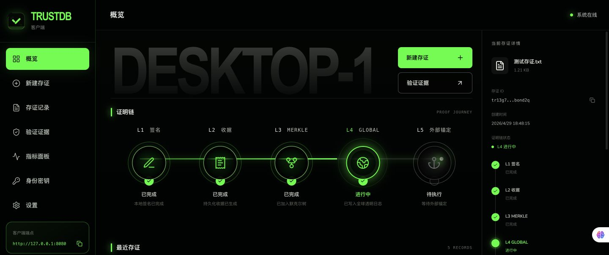

# TrustDB

<p align="center">
  
</p>


[Official Website](https://www.trustdb.ryan-wong.cn/) | [Quick Start](#quick-start) | [中文说明](README.zh-CN.md) | [Community](COMMUNITY.md) | [Roadmap](ROADMAP.md) | [Contributing](CONTRIBUTING.md)

**TrustDB is a self-hosted tamper-evident evidence database for files, audit events, and data handoffs.** It turns a local content hash into a portable proof that another party can verify offline, without uploading the original content or trusting the source database administrator.

Use it when a workflow must later answer: **what was submitted, who signed it, whether it was accepted, and whether the supplied content still matches the recorded evidence.**

- Keep original business data in its existing system; TrustDB stores hashes, signatures, receipts, and proofs.
- Export a single `.sproof` evidence file for independent and offline verification.
- Build evidence from signed claims through Merkle batches and a global transparency log.
- Run locally or self-host with the CLI, Go SDK, Docker image, desktop client, and optional TiKV proofstore.

Typical uses include release-artifact verification, data and report delivery, privileged-operation evidence, dataset/model provenance, and cross-organization handoffs. TrustDB does not make blanket legal-validity claims and does not by itself bind a cryptographic key to a real-world identity.

## Is TrustDB a fit?

| TrustDB is designed for | TrustDB does not replace |
| --- | --- |
| Portable evidence for files and data handoffs | Storage for original business content |
| Tamper-evident records for high-risk operations | Log search, tracing, or SIEM platforms |
| Independent and offline proof verification | Real-world identity and key-custody processes |
| Transparency-log and external-anchor evidence | Deployment TLS, authentication, or authorization |
| Dataset, model, report, and release provenance | Legal advice or automatic evidentiary validity |

## See tamper detection in one command

With Go installed, clone the repository and run:

```sh
./scripts/demo.sh
```

The script builds the CLI in a temporary directory, proves a sample file, verifies the original, then changes a copy and confirms that verification fails. It does not start a server or retain generated keys.

For prebuilt binaries, Docker, Windows instructions, L4/L5 evidence, and production deployment, use the [official documentation](https://www.trustdb.ryan-wong.cn/docs/quick-start).

## Join the community

- Ask a question or share deployment experience in [GitHub Discussions](https://github.com/wowtrust/trustdb/discussions).
- Propose an ecosystem connection through an [integration discussion](https://github.com/wowtrust/trustdb/discussions/categories/ideas).
- Pick an approachable [`good first issue`](https://github.com/wowtrust/trustdb/issues?q=is%3Aissue+is%3Aopen+label%3A%22good+first+issue%22).
- Add an evaluation, pilot, or production deployment to [ADOPTERS.md](ADOPTERS.md).
- Review user-visible history in the [changelog](CHANGELOG.md).


Module:

```text
github.com/wowtrust/trustdb
```

License: AGPL-3.0-only. See [LICENSE](LICENSE).

## v1.0.0

The first stable release is distributed through [GitHub Releases](https://github.com/wowtrust/trustdb/releases/tag/v1.0.0). It includes Server/CLI archives for Linux, macOS, and Windows, four self-signed desktop packages, a multi-architecture Docker image, and a single `SHA256SUMS` file.

This release establishes the `github.com/wowtrust/trustdb` module path, durable coalesced STH anchoring, covering-anchor offline evidence export, resumable L5 coverage projection, storage schema v4, and the current logical-backup format. Install the Go SDK by its stable tag:

```bash
go get github.com/wowtrust/trustdb@v1.0.0
```

The multi-architecture Docker image is published with both immutable and stable-channel tags:

```bash
docker pull wsy19990317/trustdb:1.0.0
docker run -d --name trustdb -p 127.0.0.1:8080:8080 -v trustdb-data:/var/lib/trustdb wsy19990317/trustdb:1.0.0
docker logs trustdb
curl --fail http://127.0.0.1:8080/healthz
```

Desktop packages carry a release-specific self-signed certificate and its public `.cer` file. The certificate lets you inspect the signer used for this release, but does not establish Apple or Microsoft trust, so Gatekeeper or SmartScreen may still show an unknown-developer warning. Verify the downloaded file against `SHA256SUMS` before installing.

## What It Provides

- Deterministic CBOR models for claims, receipts, proof bundles, global-log proofs, STHs, anchor results, backups, and `.sproof` files.
- Ed25519 signing for client, server, and key-registry workflows.
- WAL-backed ingest with bounded queues, configurable fsync policy, replay, checkpoints, and graceful shutdown.
- Batch Merkle proofs, persisted record indexes, and paginated record/root APIs.
- Global Transparency Log with persisted STHs, inclusion proofs, consistency proofs, and history tiles.
- L5 STH/global-root anchoring through `off`, `noop`, file, and OpenTimestamps sinks.
- File, Pebble, and TiKV proofstore backends. TiKV enables storage-compute separation, with one logical `(node_id, log_id)` stream per namespace and no same-namespace active-active writers.
- Portable `.tdbackup` create, verify, and resumable restore.
- Go SDK for claim signing, HTTP/gRPC calls, proof export, and local verification.
- Wails + Vue desktop client for local identity, file attestation, record management, proof refresh, `.sproof` export, and offline verification.
- Optional Vue Admin Web mounted by `trustdb serve` for metrics, read-only browsing, and controlled YAML config maintenance.

## Proof Levels


| Level | Meaning | Primary artifact |
| --- | --- | --- |
| L1 | Client signs a claim containing the content hash and metadata. | `SignedClaim` / `.tdclaim` |
| L2 | Server validates and accepts the claim into WAL; crash durability follows the configured fsync policy. | `AcceptedReceipt` |
| L3 | The accepted claim is committed into a batch Merkle tree. | `ProofBundle` / `.tdproof` |
| L4 | The batch root is included in the Global Transparency Log and a target STH. | `GlobalLogProof` / `.tdgproof` |
| L5 | A supported anchor sink produced a matching result for the STH/global root; only a genuinely external sink adds independent time semantics. | `STHAnchorResult` / `.tdanchor-result` |

For exchange and desktop verification, `.sproof` is the recommended single-file proof container. It can include the L3 `ProofBundle`, optional L4 `GlobalLogProof`, and optional L5 `STHAnchorResult`. The stable v1 format is documented in [formats/SPROOF_V1.md](formats/SPROOF_V1.md).

## Architecture

TrustDB runs as a single-node service by default. Multiple compute nodes may use
the same TiKV cluster, but one proofstore namespace belongs to one logical
`(node_id, log_id)` Global Log stream. An active-passive replacement may reuse
that namespace only when it keeps the same logical identity; independent logs
must use different namespaces. Same-namespace active-active writers are not
supported yet.

Core paths:

- Client path: CLI, SDK, or desktop computes a file hash, signs a claim, and submits it locally or to the server.
- Ingest path: the server validates signatures and key state, appends acceptance to WAL, and returns an accepted receipt.
- Batch path: accepted records are grouped into Merkle batches and stored as proof bundles plus indexes.
- Global log path: committed batch roots are appended into the global transparency log, producing persisted STHs and global proofs.
- Anchor path: STH/global roots are coalesced into one durable Pending target and one immutable InFlight attempt per log and sink, then published by the configured anchor worker.
- Storage path: proof data is stored in file, Pebble, or TiKV proofstores.
- Backup path: proofstore data can be exported to `.tdbackup`, verified, and restored with resumable restore state; portable backups exclude node-local WAL checkpoints.
- Observability path: `/metrics` exposes ingest, batch, global log, anchor, WAL, backup, and storage metrics.

File, Pebble, and each TiKV namespace use proofstore storage schema v4. Opening
an older or unversioned non-empty store fails explicitly; TrustDB does not
silently migrate or dual-read obsolete anchor queue layouts. Rebuild the store
or restore a current logical backup before starting this version.

`wal.fsync_mode=strict` waits for each accepted record's WAL file fsync before returning. `group` bounds the asynchronous dirty window by `wal.group_commit_interval`; `batch` defers accepted-record data fsync until rotation or close. Writer startup and the namespace barriers used for WAL directory creation, file publication, rotation, and pruning are independent of that append policy. On Windows, TrustDB fails closed when the underlying filesystem rejects its best-available directory flush. Choose `strict` when the receipt contract requires a per-record fsync; end-to-end crash durability still depends on the filesystem and storage guarantees.

Automatic WAL checkpoint skipping and segment pruning are enabled only when the proofstore can durably order committed artifacts and restart-idempotency decisions before a checkpoint, then scope that checkpoint to the node-local WAL. Pebble atomically publishes keyed restart-idempotency decisions with committed manifests and enables checkpoint skipping and pruning while that projection is ready. TiKV provides the same capability only when the store is explicitly bound to the current compute node and absolute local WAL identity. The development file backend lacks the complete idempotency projection barrier and therefore retains and replays WAL.

During upgrade, a legacy v1 checkpoint is rebuilt only from a complete retained WAL beginning at sequence 1. If an older deployment already pruned that prefix, startup fails closed with `DataLoss`; restore the complete WAL from a trusted backup rather than deleting the checkpoint marker, which cannot prove the missing records were committed.

## Quick Start

Download the prebuilt Server/CLI archive for your operating system from the [v1.0.0 release](https://github.com/wowtrust/trustdb/releases/tag/v1.0.0). Verify the archive against [`SHA256SUMS`](https://github.com/wowtrust/trustdb/releases/download/v1.0.0/SHA256SUMS) before extracting it, then run the commands below from the extracted directory. No server or Go toolchain is required. The examples use a POSIX shell; Windows users should follow the platform-specific [website quick start](https://www.trustdb.ryan-wong.cn/docs/quick-start).

Create an explicit input and a disposable working directory:

```bash
printf 'hello TrustDB\n' > example.txt
mkdir -p .trustdb-dev
```

Generate one-time client and server keys. `keygen` replaces same-name key files, so do not rerun it for an identity that has already issued evidence:

```bash
./bin/trustdb keygen --out .trustdb-dev --prefix client
./bin/trustdb keygen --out .trustdb-dev --prefix server
```

Create and sign a local file claim:

```bash
./bin/trustdb claim-file \
  --file ./example.txt \
  --private-key .trustdb-dev/client.key \
  --tenant default \
  --client local-client \
  --key-id client-key \
  --out .trustdb-dev/example.tdclaim
```

Commit the claim locally into an L3 ProofBundle, keeping its WAL inside the practice directory:

```bash
./bin/trustdb commit \
  --claim .trustdb-dev/example.tdclaim \
  --server-private-key .trustdb-dev/server.key \
  --client-public-key .trustdb-dev/client.pub \
  --wal .trustdb-dev/local-wal \
  --out .trustdb-dev/example.tdproof

./bin/trustdb proof inspect --proof .trustdb-dev/example.tdproof
```

Verify the original file by recomputing its digest, signatures, receipt, and Merkle path:

```bash
./bin/trustdb verify \
  --file ./example.txt \
  --proof .trustdb-dev/example.tdproof \
  --server-public-key .trustdb-dev/server.pub \
  --client-public-key .trustdb-dev/client.pub
```

Successful output contains `"valid":true` and `"proof_level":"L3"`. This local `commit` does not send the claim to a running server. Continue with the checked [Go SDK example](examples/sdk-onboarding) for server submission, asynchronous L4, `.sproof` export, and offline verification. Production deployment and stopped-service logical backup are covered by the [operations guide](https://www.trustdb.ryan-wong.cn/docs/server).

## HTTP And gRPC

Implemented HTTP endpoints:

| Endpoint | Purpose |
| --- | --- |
| `GET /healthz` | Health check. |
| `POST /v1/claims` | Submit a signed claim. |
| `POST /v1/claims/batch` | Submit a CBOR batch of signed claims. |
| `GET /v1/records` | Paginated record list and search. |
| `GET /v1/records/{record_id}` | Read record index details. |
| `GET /v1/proofs/{record_id}` | Fetch L3 proof bundle. |
| `GET /v1/roots` | List batch roots. |
| `GET /v1/roots/latest` | Fetch latest batch root. |
| `GET /v1/sth/latest` | Fetch latest SignedTreeHead. |
| `GET /v1/sth/{tree_size}` | Fetch a specific STH. |
| `GET /v1/global-log/inclusion/{batch_id}` | Fetch global-log inclusion proof for a batch. |
| `GET /v1/global-log/evidence/{batch_id}` | Fetch covering Global Log evidence and the matching published anchor result when available. |
| `GET /v1/global-log/consistency?from=&to=` | Fetch global-log consistency proof. |
| `GET /v1/anchors/sth/{tree_size}` | Fetch an immutable published STH anchor result. |
| `GET /metrics` | Prometheus metrics. |

The optional gRPC listener is enabled with `--grpc-listen` or `server.grpc_listen`. It uses TrustDB's deterministic CBOR payload model so HTTP and gRPC transports share proof semantics.

## Configuration

Configuration examples live in [configs](configs):

| File | Intended use |
| --- | --- |
| `configs/development.yaml` | Local development and demos. Uses file proofstore and `noop` anchoring. |
| `configs/production.yaml` | Single-node production baseline with Pebble proofstore, directory WAL, group fsync, global log, and OTS anchoring. |
| `configs/benchmark-extreme.yaml` | Maximum L2 accepted-receipt throughput with on-demand proofs; not for production. |
| `configs/benchmark-burst.yaml` | Short burst absorption with large batches and queues. |
| `configs/benchmark-l3-throughput.yaml` | High-write asynchronous L3 throughput and drain tests. |
| `configs/benchmark-proof-ready.yaml` | Prioritizes L3 materialization and lower proof backlog. |
| `configs/benchmark-balanced.yaml` | Group fsync, reduced index amplification, and L4 proofs. |
| `configs/benchmark-production-safe.yaml` | Durable L4/L5 end-to-end performance tests. |
| `configs/benchmark-production-guaranteed.yaml` | Strict fsync, full indexes, and L4/L5 performance floor. |
| `configs/benchmark-large-payload.yaml` | 16 KiB and 64 KiB payload pressure tests. |
| `configs/benchmark.yaml` | Benchmark profile with throughput-oriented settings. Not a production audit profile. |

See [configs/README.md](configs/README.md) for `run_profile` semantics and startup notes.

## Admin Web And Desktop

The optional Admin Web (`clients/web`) is served under `/admin` by `trustdb serve` when enabled. It provides metrics, read-only API browsing, and YAML config maintenance when the server is started with `--config`.

The desktop client (`clients/desktop`) is a Wails + Vue application for local identity setup, file attestation, server settings, local record indexes, proof refresh, proof export, and offline verification.

The official website source now lives in `website`. It is a standalone React + Vite application with generated visual assets and GSAP motion, and it is validated in the main repository CI.

The screenshot below is rendered directly from the current desktop client code:



## Project Documents

- [ARCHITECTURE.zh-CN.md](ARCHITECTURE.zh-CN.md): detailed TrustDB server, persistence, Global Log, anchoring, SDK, backup, and offline-verification architecture (Chinese).
- [COMMUNITY.md](COMMUNITY.md): support, discussion, and first-contribution entry points.
- [ROADMAP.md](ROADMAP.md): public product direction and ways to influence it.
- [SECURITY.md](SECURITY.md): private vulnerability reporting and supported-version policy.
- [LICENSE-FAQ.md](LICENSE-FAQ.md): practical AGPL adoption questions and project boundaries.
- [ADOPTERS.md](ADOPTERS.md): public evaluations, pilots, and production users.
- [CHANGELOG.md](CHANGELOG.md): curated user-visible release history and known limitations.
- [docs/compliance/CHINA_COMPLIANCE_SCOPE_AND_CONTROL_MATRIX.zh-CN.md](docs/compliance/CHINA_COMPLIANCE_SCOPE_AND_CONTROL_MATRIX.zh-CN.md): versioned China compliance scope, control ownership, release gates, evidence requirements, and assessment boundaries (Chinese).
- [CONTRIBUTING.md](CONTRIBUTING.md): issue, PR, commit, validation, and review standards.
- [formats/SPROOF_V1.md](formats/SPROOF_V1.md): stable `.sproof` v1 exchange format.
- [formats/DISTRIBUTED_ARCHITECTURE.md](formats/DISTRIBUTED_ARCHITECTURE.md): distributed/storage-compute separation notes.
- [docs/performance/trustdb-sustained-stream-persistence-assessment-2026-07-23.zh-CN.md](docs/performance/trustdb-sustained-stream-persistence-assessment-2026-07-23.zh-CN.md): the single performance reference for L2-L5, HTTP/gRPC, backpressure, persistence, and configuration semantics (Chinese).
- [docs/performance/trustdb-performance-optimization-2026-07.zh-CN.md](docs/performance/trustdb-performance-optimization-2026-07.zh-CN.md): performance implementation notes (Chinese).

## Community Acknowledgements

TrustDB gratefully acknowledges the [LINUX DO community](https://linux.do/) for fostering open technical discussion and open-source collaboration.

Questions and integration ideas belong in [GitHub Discussions](https://github.com/wowtrust/trustdb/discussions). Confirmed bugs and accepted engineering work belong in [GitHub Issues](https://github.com/wowtrust/trustdb/issues). See the [community guide](COMMUNITY.md), [roadmap](ROADMAP.md), [security policy](SECURITY.md), [license FAQ](LICENSE-FAQ.md), and [adopters page](ADOPTERS.md).

## Development Checks

Use the smallest relevant set while iterating, then run broader checks before merge:

```powershell
go test ./...
go test -race ./...
go test -tags=integration ./...
go test -tags=e2e ./...
```

Frontend and desktop checks:

```powershell
cd clients/web
npm ci
npm run build

cd ../../website
npm ci
npm run build

cd ../clients/desktop
go test ./...
```

See [CONTRIBUTING.md](CONTRIBUTING.md) for the standard issue, PR, and commit formats.
