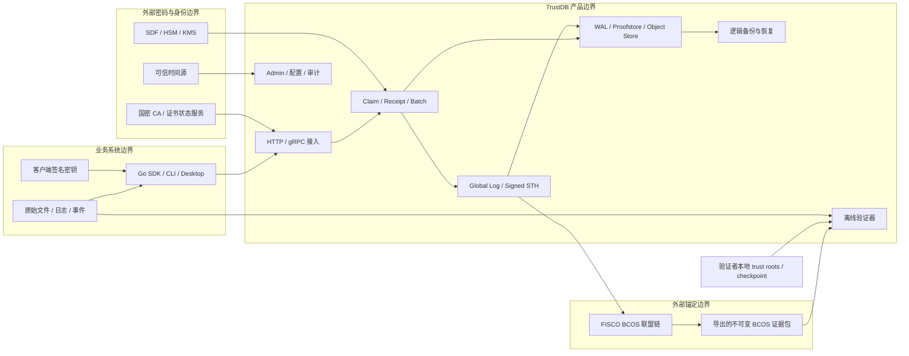

# TrustDB 国产合规范围与控制矩阵

> 文档编号：`TDB-CN-CM-001`
>
> 版本：`0.1.5`
>
> 基线日期：`2026-07-23`
>
> 状态：国产合规工程基线；不代表具体部署已经通过测评或认证
>
> 适用对象：TrustDB Server/CLI、Go SDK、Desktop、proofstore、Global Log、Anchor、逻辑备份、发布制品和参考部署

## 1. 文档目的

本文把“国产合规”拆成可以设计、实现、测试和审计的控制项，并为每个控制项明确：

- 触发条件和依据；
- TrustDB 产品需要交付的能力；
- 具体部署方仍需完成的工作；
- 责任角色；
- 可供评审或测评机构复核的证据；
- 阻止发布的 Gate。

本文是工程和测评准备基线，不是法律意见、测评报告或认证证书。支持 SM2、SM3、SM4、TLCP 或 FISCO BCOS，只能证明产品具备相应技术能力，不能单独推出某个部署已经通过商用密码应用安全性评估、网络安全等级保护测评、商用密码产品认证或司法真实性审查。

配套的[`国产密码威胁模型与合规证据映射`](NATIONAL_CRYPTOGRAPHY_THREAT_MODEL_AND_EVIDENCE_MAP.zh-CN.md)固定资产、攻击者、信任边界、高风险场景、禁止的信任捷径、tabletop 和 evidence family；具体部署仍需基于实际人员、网络、数据、密码设备和联盟治理形成自己的风险登记册。

## 2. 合规目标与判定边界

### 2.1 默认目标

TrustDB 国产部署版本按以下目标设计：

1. 提供 `CN_SM_V1` 密码套件，覆盖 SM3 哈希与 Merkle tree、SM2 签名、SM4 密钥/备份保护及国密传输接入。
2. 生产签名密钥可以留在 SDF/HSM 或经过批准的国产 KMS 边界内，不要求导出私钥。
3. FISCO BCOS 作为 L5 外部 Anchor Sink；标准链和国密链均有明确的兼容矩阵和信任配置。
4. `.sproof` 证据继续可以完全离线复算；验证过程不访问 TrustDB、CA、BCOS 节点或网络 provider。
5. 产品能力以“等保三级、密码应用第三级部署就绪”为工程参考目标；实际定级对象和等级由网络运营者依定级指南组织确定并履行相应审核、备案程序，密评适用性和等级由具体系统的法律义务及密码应用方案确定。
6. 中国生产模式不依赖 GitHub、Docker Hub、境外遥测、公共时间戳或境外 SaaS 才能运行。

### 2.2 可以由仓库交付的结论

- 指定版本实现了经测试的算法、协议、接口和证据格式。
- 指定参考部署满足项目定义的技术基线和自动化 Gate。
- 指定测试向量、恢复演练、渗透/模糊测试或预评估问题已经通过或关闭。
- 某份离线证据在给定本地信任根下通过了确定性的密码学验证。

### 2.3 不能由仓库单独给出的结论

- “TrustDB 已通过等保三级”——等保对象是有明确边界的实际信息系统。
- “TrustDB 已通过密评”——密评结论属于具体信息系统、密码应用方案和运行环境。
- “使用开源国密库即符合商用密码产品要求”——生产环境还涉及产品/模块认证、密钥设备、证书和运维制度。
- “写入 FISCO BCOS 即获得司法认可或可信时间”——区块时间、电子数据真实性与证据采信仍需结合完整生成、收集、存储、传输和信任材料判断。
- “摘要不属于个人信息”——可关联自然人的摘要、标识符和元数据仍可能属于个人信息。

### 2.4 目标部署与适用性筛查记录

本矩阵先以 `TDB-CN-ASR-001 v0.1.0` 作为参考目标部署的适用性记录：系统部署在中国大陆境内的单一企业私有网络或私有云，TrustDB 接收业务系统提交的摘要、声明和可配置元数据，原始业务内容默认不入库；计划使用境内部署的 FISCO BCOS 联盟链，生产运行不依赖境外服务或未经批准的数据出境链路。参考实现按三级技术要求准备，但未获得任何具体客户的定级、关基认定、重要数据目录或产品认证目录判定材料。

`TBD` 是明确的待决结论，不等于“不适用”。产品基线可以在记录了 Owner、截止证据和 fail-closed 策略后批准；具体部署的 `G0` 在影响该部署的 `TBD` 关闭前不得通过。

| 筛查项 | 结论 | 当前判定和产品策略 | 决策 Owner | 关闭或维持结论所需证据 |
| --- | --- | --- | --- | --- |
| 是否纳入网络安全等级保护制度 | `Yes` | 参考目标作为在境内运行的网络信息系统执行等级保护基线 | Deployment Owner | 系统边界、资产清单、安全责任主体和定级对象清单 |
| 拟定保护等级与备案 | `TBD` | 三级仅为产品工程目标，不能替代危害后果分析、专家评审和主管部门审核/备案 | Deployment Owner | 定级报告、评审意见、审核/备案材料 |
| 是否属于依法应开展密评的重要网络与信息系统及密码应用等级 | `TBD` | 在适用性确认前按第三级能力设计；不得据此宣称已经适用或通过密评 | Deployment Owner + Security & Cryptography | 适用性意见、批准的密码应用方案、系统定级和相关主管要求 |
| 是否被认定为关键信息基础设施 | `TBD` | 不自行宣称是或不是关基；一旦收到保护工作部门认定通知，启用 CII 强化 Profile | Protection Working Department + Deployment Owner | 正式认定/告知材料或经批准的适用性记录 |
| 交付形态是否落入商用密码产品认证目录 | `TBD` | 在算法库、软件、密码模块、设备和云服务边界固定后逐项核对当期目录 | Certification Applicant | 产品边界说明、目录比对意见、所依赖产品证书 |
| 是否处理个人信息或敏感个人信息 | `Yes` | `Metadata.Custom`、标识符和 `StorageURI` 可能关联自然人，产品按可能含个人信息处理 | Data Controller / Legal | 字段级数据目录、处理目的与法律基础、个人信息影响评估（如触发） |
| 是否处理重要数据 | `TBD` | 不能仅凭摘要形态排除；按行业/地区重要数据目录和业务语义识别 | Data Controller / Legal | 数据分类分级结果、适用目录、主管部门确认（如有） |
| 是否处理核心数据 | `TBD` | 当前没有认定材料；一旦识别即单独评审，不能沿用一般/重要数据结论 | Data Controller / Legal | 核心数据识别材料及适用的专项评估记录 |
| 是否发生数据出境 | `No` | 参考目标禁止必需的境外依赖、遥测和未批准 egress；实际部署出现境外接收方或远程访问即重新判定 | Deployment Owner + Data Controller / Legal | egress allowlist、网络抓取、第三方和远程运维清单 |
| 是否开展网络数据安全风险评估 | `Yes` | 作为项目政策在上线前、每年及重大变更后评估；法律要求更高时从其规定 | Deployment Owner + Data Controller / Legal | 风险评估报告、整改记录、报送回执（如触发）和至少三年留存证明 |

该记录的任何结论变化都必须提升记录版本，并同步更新控制矩阵、风险台账、密码应用方案和发布声明。

## 3. 系统、数据和信任边界



`BCOS --> Bundle --> Verify` 表示由受控导出过程预先收集交易、回执、Merkle proof、区块头、PBFT quorum 签名和成员变更材料，不表示离线验证器连接 BCOS。验证时所有外部证据和 trust roots 都来自验证者本地输入。

### 3.1 产品范围内

- 数据模型、确定性编码、算法套件和证明语义；
- 服务端、CLI、Go SDK、Desktop 和离线验证器；
- WAL、file/Pebble/TiKV proofstore、对象存储及逻辑备份；
- HTTP/gRPC 安全配置和 TLCP 接入边界；
- 密钥 provider 接口、密钥引用和公开证书材料；
- Global Log、Signed STH、Anchor 调度及 FISCO BCOS 证据；
- Admin 权限、安全审计、指标、健康检查和启动策略；
- 源码依赖、CI、SBOM、发布制品、校验和及离线安装材料。

### 3.2 部署范围内但不由仓库独立控制

- 网络安全等级保护定级、备案和正式测评边界；
- 密码应用方案、正式密评和年度/周期性复评；
- 业务处理目的、个人信息法律基础、告知同意和数据主体请求；
- 机房、网络区划、主机、数据库、堡垒机、终端和组织制度；
- HSM/KMS、CA、时间源和 FISCO BCOS 联盟的采购、治理及证书；
- 运维人员背景、岗位分离、审批、培训、应急响应和审计留存；
- 重要数据识别、数据出境、安全审查和关键信息基础设施认定。

### 3.3 明确排除

- TrustDB 默认不要求保存原始文件或业务日志正文；原文仍由业务系统管理。
- 本文不替代法律顾问、数据合规负责人、密评机构或等保测评机构的意见。
- 本文不把 BCOS 节点返回值、证据文件自带公钥或证据文件自带根证书自动视为信任根。
- 本文不承诺尚未进入兼容矩阵的国产 OS、CPU、数据库、HSM、KMS 或 BCOS 版本。

### 3.4 控制到代码组件的索引

该索引用于把矩阵控制快速路由到真实工程边界；路径变化时必须随本文更新。

| 组件或路径 | 当前职责 | 主要控制组 |
| --- | --- | --- |
| `internal/model`、`internal/cborx` | 证据模型、schema 和确定性编码 | `CRY-*`、`EVD-*`、`DATA-*` |
| `internal/trustcrypto`、`internal/merkle` | 哈希、签名、验签和 Merkle 计算 | `CRY-01`–`CRY-03`、`EVD-01`–`EVD-04` |
| `internal/claim`、`internal/receipt`、`internal/app` | 客户端声明、服务端接受和回执签发 | `IAM-*`、`CRY-*`、`EVD-01` |
| `internal/keystore` | 客户端 key registry 和状态事件 | `IAM-01`–`IAM-03`、`CRY-03`、`CRY-05`–`CRY-07` |
| `internal/wal`、`internal/proofstore`、`internal/objectstore` | 耐久写入、证据存储和索引 | `DATA-*`、`CRY-04`、`EVD-03`、`OPS-05`、`OPS-10` |
| `internal/globallog`、`internal/anchor`、`internal/l5projector` | Global Log、STH、外部锚定和 L5 投影 | `EVD-03`–`EVD-07`、`OPS-06`、`OPS-10` |
| `internal/verify`、`internal/sproof`、`formats` | 离线验证、交换格式和 trust-root 规则 | `CRY-01`–`CRY-03`、`EVD-01`–`EVD-07` |
| `internal/httpapi`、`internal/grpcapi`、`cmd/trustdb` | 网络入口、CLI、服务启动和策略配置 | `DATA-02`、`IAM-*`、`CRY-07`–`CRY-08`、`OPS-01` |
| `internal/adminweb`、`clients/web` | 管理鉴别、配置和运维界面 | `IAM-01`–`IAM-03`、`OPS-01`–`OPS-04` |
| `sdk`、`clients/desktop` | 业务接入、客户端身份、证据导出和验证体验 | `DATA-*`、`IAM-*`、`CRY-*`、`EVD-*` |
| `internal/backup` | 逻辑备份、校验和可恢复 restore | `CRY-04`、`EVD-03`、`OPS-05` |
| `configs`、`.github/workflows`、发布制品 | 参考部署、CI、供应链和交付 | `OPS-01`、`OPS-07`–`OPS-10`、`ASS-*` |

## 4. 角色与责任

| 角色 | 主要责任 | 必须提供的证据 |
| --- | --- | --- |
| Product Owner | 批准产品边界、合规目标、发布声明和风险接受 | 范围批准记录、发布声明审批、风险接受单 |
| Security & Cryptography | 密码套件、威胁模型、算法/协议选型、密钥策略和验证规则 | ADR、测试向量、密码应用设计、评审记录 |
| Engineering | 按统一套件实现服务端、SDK、CLI、Desktop 和离线验证器 | 代码、单元/集成测试、跨组件向量、性能报告 |
| Release Engineering | 可复现构建、依赖治理、SBOM、制品签名和境内/离线分发 | provenance、SBOM、签名制品、发布与镜像同步记录 |
| Platform / SRE | 网络、主机、证书、时间、备份、日志、监控、应急和离线部署 | 配置基线、运行记录、演练报告、资产清单 |
| Deployment Owner | 组织确定系统边界与等级、筛查密评适用性、批准外部服务和运行制度 | 定级材料、密码应用方案、数据清单、合同与制度 |
| Data Controller / Legal | 处理目的、法律基础、最小化、留存、个人信息和出境判断 | 数据处理记录、影响评估、授权/告知和留存策略 |
| Local Evidence Verifier | 独立保管 trust roots/checkpoint，并在断网环境复算证据 | trust 配置、验证日志、验证器版本和输入摘要 |
| External Crypto & BCOS Operators | 运营 CA、HSM/KMS、可信时间和 BCOS，并提供受控外部服务 | 产品证书、密钥仪式、节点/合约治理、变更记录 |
| Protection Working Department | 依法认定或告知关键信息基础设施并提出行业主管要求 | 正式认定/告知、检查和整改要求 |
| Commercial Cryptography Assessment Executor | 在法律允许时由运营者具备能力的团队自行密评，或由受委托的商用密码检测机构执行 | 密评报告、问题清单、签字盖章和整改确认 |
| MLPS Assessment Institution | 执行网络安全等级保护正式测评 | 测评报告、问题清单和整改复核 |
| Certification Applicant | 固定产品与密码边界、核对认证目录并发起认证或采购合格产品 | 目录比对、申请/采购材料和证书台账 |
| Certification Body | 在授权范围内实施产品检测认证 | 正式产品证书、检测报告和有效期信息 |
| Supplier | 提供国产环境组件、兼容声明、支持边界和漏洞响应 | 版本清单、互认证报告、产品证书和 SLA |

责任规则：产品团队只能关闭“产品能力”和“评估准备”项；标记为 `External` 的控制只能凭对应外部主体的有效材料关闭。商用密码应用安全性评估在法规允许时可以由运营者自行或委托商用密码检测机构开展。TrustDB 对外使用“通过密评”等正式声明时额外要求独立机构复核，这是本项目的发布政策，不是对法规允许自评的否定。

## 5. 数据分类与默认处理规则

| 数据类别 | 示例 | 默认位置 | 默认保护与限制 | 主要责任方 |
| --- | --- | --- | --- | --- |
| 原始业务内容 | 文件、日志正文、事件载荷 | 业务系统 | 默认不进入 TrustDB；验证时由验证者另行提供 | Deployment Owner |
| 声明与业务元数据 | tenant/client、事件类型、URI、自定义 metadata | WAL / proofstore / backup | 按可识别性和业务语义分类；执行最小化与字段白名单 | Engineering + Data Controller / Legal |
| 内容摘要 | SHA-256 或 SM3 digest | 证明、索引、Anchor payload | 不视为天然匿名；链上只放必要摘要和版本化绑定 | Engineering + Data Controller / Legal |
| 签名与公开密钥材料 | SM2/Ed25519 签名、公钥、证书链、KeyID | 证明、registry、backup | 可导出用于验证；信任根必须由验证者本地配置 | Security & Cryptography |
| 私钥与 KEK | 客户端/服务端/Anchor 账户私钥、备份 KEK | HSM/KMS 或加密 key envelope | 禁止进入日志、API、`.sproof` 或逻辑备份明文 | Security & Cryptography + Platform / SRE |
| 证明数据 | Receipt、Merkle path、STH、Anchor result | proofstore / `.sproof` / backup | 不可变、可校验、版本化；按元数据敏感性控制访问 | Engineering |
| BCOS 证据 | 交易、回执、Merkle proof、区块头、共识材料 | Anchor result / `.sproof` | 不上传业务原文；合约、chain/group 和 checkpoint 必须固定 | Engineering + External Crypto & BCOS Operators |
| 安全审计 | 登录、配置、密钥、恢复、权限和策略变更 | 独立审计存储 | 防篡改、限制读取、按要求留存并可导出 | Platform / SRE |
| 运行日志与指标 | 错误、延迟、队列、主机与请求信息 | 日志/监控平台 | 默认脱敏；禁止密钥、token、正文和完整证据泄露 | Platform / SRE |
| 备份与恢复状态 | `.tdbackup`、checkpoint、恢复报告 | 备份介质 | 加密、完整性校验、分权保管、定期恢复演练 | Platform / SRE |

## 6. 适用依据

以下链接指向国家法律法规数据库、中国政府网、国家密码管理局、国家标准全文公开系统和最高人民法院等官方来源。实施或送测前必须再次核对现行状态、替代标准和具体适用条款。

### 6.1 法律、行政法规和管理办法

| 引用 ID | 依据 | 本项目关注点 |
| --- | --- | --- |
| `LAW-CSL` | [《中华人民共和国网络安全法》现行文本](https://flk.npc.gov.cn/detail?id=021e7d7684474107b8f3febbb1c4f8b5) | 等级保护、安全运行、日志、事件和网络运营者责任 |
| `LAW-CRYPT` | [《中华人民共和国密码法》](https://flk.npc.gov.cn/detail?id=ff8080816f3cbb3c016f5acf6a244210) | 商用密码应用、密码产品/服务和关基密码要求 |
| `REG-CRYPT` | [《商用密码管理条例》](https://www.gov.cn/zhengce/content/202305/content_6875927.htm) | 密码应用同步规划建设运行、检测认证和监督管理 |
| `MEASURE-CRYPT` | [《商用密码应用安全性评估管理办法》](https://www.gov.cn/zhengce/202501/content_6997433.htm) | 密评适用对象、程序、机构与整改责任 |
| `LAW-DSL` | [《中华人民共和国数据安全法》](https://flk.npc.gov.cn/detail?id=ff80818179f5e0800179f885c7e70392) | 分类分级、全生命周期保护、风险监测和事件处置 |
| `LAW-PIPL` | [《中华人民共和国个人信息保护法》](https://flk.npc.gov.cn/detail?id=ff8081817b6472a3017b656cc2040044) | 处理目的、最小必要、敏感信息、影响评估和跨境处理 |
| `REG-NETDATA` | [《网络数据安全管理条例》（国务院令第 790 号）](https://app.www.gov.cn/govdata/gov/202409/30/520076/article.html) | 网络数据分类分级、技术措施、个人信息合规审计、重要数据和安全事件 |
| `MEASURE-DATA-RISK` | [《网络数据安全风险评估办法》（三部门令第 24 号）](https://www.cac.gov.cn/2026-06/18/c_1783525609815499.htm) | 已公布并于 2026-08-20 施行；重要数据年度/变更评估、报告报送和至少三年留存 |
| `REG-CII` | [《关键信息基础设施安全保护条例》](https://flk.npc.gov.cn/detail?id=ff8081817b63b935017b7bcc49877e0b) | 仅在部署被认定为关基时触发的专项义务 |
| `RULE-CII-CRYPT` | [《关键信息基础设施商用密码使用管理规定》（三部门令第 5 号）](https://www.oscca.gov.cn/sca/xxgk/2025-06/27/content_1061270.shtml) | 关基密码同步规划建设运行、产品/服务要求、专业岗位、年度密评与报告 |
| `CATALOG-CRYPT` | 商用密码产品认证目录[第一批及认证规则](https://www.oscca.gov.cn/sca/xwdt/2020-05/11/content_1060749.shtml)、[第二批](https://www.samr.gov.cn/zw/zfxxgk/fdzdgknr/rzjgs/art/2023/art_9c30204708974c0eb939cbaff507f8d5.html)、[第三批](https://www.samr.gov.cn/zw/zfxxgk/fdzdgknr/rzjgs/art/2025/art_2d6ced073d784f4fa74b4fe5e5d60b4b.html) | 按交付形态逐项筛查软件、模块、设备和服务的认证适用性 |
| `DIRECTORY-CRYPT-ASSESSOR` | [国家密码管理局公告第 53 号：商用密码检测机构（密评业务）目录](https://www.oscca.gov.cn/sca/xwdt/2025-10/27/content_1061299.shtml) | 委托外部密评时核验机构业务资质；实施时再次核对最新替代目录 |
| `LAW-ESIGN` | [《中华人民共和国电子签名法》](https://flk.npc.gov.cn/detail?id=ff8080816f135f46016f2163e4261aa1) | 电子签名可靠性和电子数据保存条件 |
| `SPC-INTERNET` | [最高人民法院关于互联网法院审理案件若干问题的规定](https://www.court.gov.cn/zixun/xiangqing/116981.html) | 哈希、电子签名、可信时间戳和区块链是真实性审查因素，不是自动采信结论 |

### 6.2 密评、等保和密码技术标准

| 引用 ID | 标准 | 本项目用途 |
| --- | --- | --- |
| `STD-39786` | [GB/T 39786-2021 信息系统密码应用基本要求](https://openstd.samr.gov.cn/bzgk/std/newGbInfo?hcno=53282C88712CE157043B7A2C590278FC) | 密码应用控制基线 |
| `STD-43206` | [GB/T 43206-2023 信息系统密码应用测评要求](https://openstd.samr.gov.cn/bzgk/std/newGbInfo?hcno=EE1B34C97A17C6F13FA9A9D891C144C2) | 测评对象、检查项和证据准备 |
| `STD-43207` | [GB/T 43207-2023 信息系统密码应用设计指南](https://openstd.samr.gov.cn/bzgk/std/newGbInfo?hcno=851A7FC4DDC2F6E9BE2677127863CCF8) | 密码应用方案和架构设计 |
| `STD-22240` | [GB/T 22240-2020 网络安全等级保护定级指南](https://openstd.samr.gov.cn/bzgk/std/newGbInfo?hcno=63B89FFF7CC97EBBBED8A403396F0F00) | 部署系统定级输入 |
| `STD-22239` | [GB/T 22239-2019 网络安全等级保护基本要求](https://openstd.samr.gov.cn/bzgk/std/newGbInfo?hcno=BAFB47E8874764186BDB7865E8344DAF) | 等保三级参考控制基线 |
| `STD-25070` | [GB/T 25070-2019 网络安全等级保护安全设计技术要求](https://openstd.samr.gov.cn/bzgk/std/newGbInfo?hcno=9FB6EE8597B21436D0E99BF44FD42C4D) | 安全设计和区域边界 |
| `STD-28448` | [GB/T 28448-2019 网络安全等级保护测评要求](https://openstd.samr.gov.cn/bzgk/std/newGbInfo?hcno=7E736CDF4502B6FF1258DD250AA3EC8C) | 等保测评证据准备 |
| `STD-28449` | [GB/T 28449-2018 网络安全等级保护测评过程指南](https://openstd.samr.gov.cn/bzgk/std/newGbInfo?hcno=CEC24F959F301862A3516CAAF117E70F) | 测评计划和整改闭环 |
| `STD-SM2` | [GB/T 32918.1-2016 SM2 总则](https://openstd.samr.gov.cn/bzgk/std/newGbInfo?hcno=3EE2FD47B962578070541ED468497C5B)、[第 2 部分：数字签名算法](https://openstd.samr.gov.cn/bzgk/std/newGbInfo?hcno=6F1FAEB62F9668F25F38E0BF0291D4AC)和[第 5 部分：参数定义](https://openstd.samr.gov.cn/bzgk/std/newGbInfo?hcno=728DEA8B8BB32ACFB6EF4BF449BC3077) | SM2 参数、签名/验签和互操作基础 |
| `STD-SM3` | [GB/T 32905-2016 SM3 密码杂凑算法](https://openstd.samr.gov.cn/bzgk/std/newGbInfo?hcno=45B1A67F20F3BF339211C391E9278F5E) | 内容、内部绑定和 Merkle 哈希 |
| `STD-SM4` | [GB/T 32907-2016 SM4 分组密码算法](https://openstd.samr.gov.cn/bzgk/std/newGbInfo?hcno=7803DE42D3BC5E80B0C3E5D8E873D56A) | 私钥信封、备份和静态数据保护 |
| `STD-BLOCK-MODE` | [GB/T 17964-2021 分组密码算法的工作模式](https://openstd.samr.gov.cn/bzgk/std/newGbInfo?hcno=4F89D833626340B1F71068D25EAC737D) | SM4 认证加密 envelope 的工作模式与参数依据 |
| `STD-SM2-USE` | [GB/T 35276-2017 SM2 密码算法使用规范](https://openstd.samr.gov.cn/bzgk/std/newGbInfo?hcno=2127A9F19CB5D7F20D17D334ECA63EE5) | SM2 编码、身份参数和互操作约束 |
| `STD-TLCP` | [GB/T 38636-2020 传输层密码协议 TLCP](https://openstd.samr.gov.cn/bzgk/std/newGbInfo?hcno=778097598DA2761E94A5FF3F77BD66DA) | 国密传输 Profile |
| `STD-CERT` | [GB/T 20518-2018 信息安全技术 公钥基础设施 数字证书格式](https://openstd.samr.gov.cn/bzgk/std/newGbInfo?hcno=F7B410A1B0C06206E5FFB0FBFEE82C75) | 证书、链和标识材料 |
| `STD-MODULE` | [GB/T 37092-2018 信息安全技术 密码模块安全要求](https://openstd.samr.gov.cn/bzgk/std/newGbInfo?hcno=91CF88FCE66F0F057DED0272AC726657) | 密码模块和密钥边界 |

SDF/HSM 接口实现应在开发启动时从[国家密码管理局](https://www.oscca.gov.cn/)核对 GM/T 0018 等行业标准的现行版本和目标设备厂商扩展，不在代码中假设所有厂商 ABI 完全一致。

## 7. 发布 Gate

| Gate | 名称 | 通过条件 | 可关闭角色 |
| --- | --- | --- | --- |
| `G0` | Scope Approved | 系统/数据/信任边界、适用条件、责任和不当宣传禁令获批准 | Product Owner + Security & Cryptography + Deployment Owner |
| `G1` | Crypto Design Approved | `CN_SM_V1`、格式版本、LogID 切换、SM2 ZA/编码和 trust-root 规则完成评审 | Security & Cryptography |
| `G2` | Crypto Core Verified | SM2/SM3/SM4 向量、跨组件互操作、负向测试和性能预算通过 | Security & Cryptography + Engineering |
| `G3` | Key & Transport Ready | 生产私钥不落软件明文；HSM/SDF/KMS、证书、mTLS/TLCP 与轮换演练通过 | Security & Cryptography + Platform / SRE |
| `G4` | BCOS Offline L5 Ready | 回执包含证明和 PBFT 终局性分别验证；成员变更和 checkpoint 规则通过 | Security & Cryptography + External Crypto & BCOS Operators |
| `G5` | Operations Ready | RBAC、审计、时间、备份恢复、监控、应急、离线安装和供应链 Gate 通过 | Platform / SRE |
| `G6` | Assessment Ready | 密码应用方案、控制证据、等保证据和预评估高风险项完成 | Deployment Owner + Commercial Cryptography Assessment Executor |
| `G7` | Formal Deployment Result | 特定部署取得所需正式报告/证书，结论和有效期入库；密评对外声明执行项目规定的独立复核 | Commercial Cryptography Assessment Executor / MLPS Assessment Institution / Certification Body |

`G0`–`G6` 是产品与部署准备 Gate；`G7` 不是软件 CI 可以自动通过的 Gate。

## 8. 控制矩阵

状态定义：

- `Existing`：当前代码已有可复核基础能力；仍需部署配置和证据。
- `Partial`：有相关基础，但不满足本控制完整目标。
- `Planned`：国产合规路线图必须实现。
- `Deployment`：主要由具体部署方完成，产品提供模板或采集能力。
- `External`：必须由外部机构或供应商材料证明。

### 8.1 治理、边界与风险

| ID | 依据与控制目标 | TrustDB 产品责任 / 当前状态 | 部署方责任 | Owner | 证据 | Gate |
| --- | --- | --- | --- | --- | --- | --- |
| `GOV-01` | `LAW-CSL` `REG-NETDATA` `STD-22240` `STD-25070`：唯一、可复现的系统边界 | 发布组件清单、数据流和外部依赖；本文建立基线。`Partial` | 确定实际定级对象、网络区域、运营者和关联服务 | Product Owner + Deployment Owner | 架构图、资产清单、边界批准记录 | `G0` |
| `GOV-02` | `LAW-CRYPT` `REG-CRYPT`：密码应用同步规划建设运行 | 将密码方案、实现、运行和退役放入同一路线图。`Planned` | 批准密码应用方案、预算、采购和运行制度 | Security & Cryptography + Deployment Owner | 密码应用方案、项目计划、评审纪要 | `G1` `G6` |
| `GOV-03` | `LAW-DSL` `LAW-PIPL` `REG-NETDATA`：数据角色和处理目的明确 | 提供数据字段目录及配置默认值。`Partial` | 记录法律基础、处理目的、数据角色和数据主体流程 | Data Controller / Legal | 数据处理活动记录、字段清单、影响评估 | `G0` `G6` |
| `GOV-04` | `REG-CII` `RULE-CII-CRYPT`：关基义务只按正式认定触发 | 提供 CII 强化 Profile，覆盖认证产品、专岗、年度密评/报告和事件证据。`Deployment` | 配合保护工作部门认定；被认定后执行专项义务 | Protection Working Department + Deployment Owner | 正式认定/告知、年度评估/报告、人员和供应链记录 | `G6` `G7` |
| `GOV-05` | 全部依据：风险接受可追溯 | [`TDB-CN-TM-001`](NATIONAL_CRYPTOGRAPHY_THREAT_MODEL_AND_EVIDENCE_MAP.zh-CN.md) 已为 High/Critical 威胁记录 Owner、计划控制、测试、证据、Gate 和残余风险；CI 例外审批、到期复审和部署级风险台账仍待运行流程，`Partial` | 建立风险审批、到期复审和补偿措施 | Product Owner | 威胁模型、风险台账、tabletop、例外审批、到期记录 | `G0`–`G6` |

### 8.2 数据分类、最小化、留存和出境

| ID | 依据与控制目标 | TrustDB 产品责任 / 当前状态 | 部署方责任 | Owner | 证据 | Gate |
| --- | --- | --- | --- | --- | --- | --- |
| `DATA-01` | `LAW-DSL` `LAW-PIPL` `REG-NETDATA`：数据目录和分类分级 | 导出字段级数据字典，标记可能的个人/敏感/重要数据。`Planned` | 结合业务语义确认分类、重要数据和敏感个人信息 | Data Controller / Legal | 数据目录、分类结果、Owner 与复核日期 | `G0` `G6` |
| `DATA-02` | `LAW-PIPL` `REG-NETDATA`：目的明确和最小必要 | 当前有请求大小限制，但 `Metadata.Custom` 和 `StorageURI` 可接收任意字符串；增加 versioned schema、字段 allowlist、敏感字段拒绝/脱敏和部署级扩展审批。`Partial` | 禁止把无必要原文、证件号等放入 metadata/URI | Engineering + Data Controller / Legal | API schema、大小/拒绝测试、字段 allowlist、扩展审批和抽查记录 | `G5` |
| `DATA-03` | `LAW-DSL` `LAW-PIPL` `REG-NETDATA`：全生命周期与留存 | 为记录、审计、备份和派生索引分别记录 retention policy。`Planned` | 定义法定/业务留存、删除和争议保全规则 | Data Controller / Legal + Platform / SRE | 留存表、删除/密钥销毁记录、恢复点清单 | `G5` `G6` |
| `DATA-04` | `LAW-PIPL` `REG-NETDATA`：删除与不可变证据协调 | 支持原载荷不入库、对象删除或密钥销毁；明确摘要保留依据。`Partial` | 响应数据主体请求并判断摘要继续保留的合法基础 | Data Controller / Legal | 请求处理记录、密钥销毁/对象删除报告 | `G6` |
| `DATA-05` | `LAW-DSL` `LAW-PIPL` `REG-NETDATA`：跨境和第三方传输受控 | 中国生产 Profile 默认禁止境外遥测和必需的境外运行依赖。`Planned` | 识别出境活动、依法完成评估/合同/认证等程序 | Deployment Owner + Data Controller / Legal | egress allowlist、网络测试、第三方清单 | `G5` `G7` |
| `DATA-06` | `MEASURE-DATA-RISK`：风险评估、报送和留存可执行 | 输出版本化数据清单、处理活动、威胁、控制和整改模板，并记录重大变化。`Planned` | 重要数据处理者每年及重大变化时评估，按要求报送并至少保存报告三年；一般数据按适用要求或项目政策执行 | Deployment Owner + Data Controller / Legal | 风险评估报告、整改闭环、报送回执和留存证明 | `G6` `G7` |

### 8.3 身份、访问控制与岗位分离

| ID | 依据与控制目标 | TrustDB 产品责任 / 当前状态 | 部署方责任 | Owner | 证据 | Gate |
| --- | --- | --- | --- | --- | --- | --- |
| `IAM-01` | `STD-22239` `STD-39786`：唯一身份和鉴别 | 服务、管理员、Anchor 发布者和密钥操作使用独立身份。Admin 当前仅单账户基础鉴别，`Partial` | 接入组织身份源，执行账号全生命周期 | Engineering + Platform / SRE | 账号清单、认证配置、离职/禁用抽查 | `G5` |
| `IAM-02` | `STD-22239`：最小权限与 RBAC | 定义 viewer/operator/security-auditor/key-admin 等角色。`Planned` | 按岗位授权并周期复核 | Engineering + Deployment Owner | 权限矩阵、授权审批、季度复核 | `G5` |
| `IAM-03` | `STD-39786` `RULE-CII-CRYPT`：关键操作分权和密码专岗 | 密钥、Anchor、备份恢复和安全策略变更支持双人审批/外部编排；CII Profile 分离密钥管理员、密码操作员和密码安全审计员。`Planned` | 落实岗位分离、人员能力/背景审查、MFA、堡垒机和审批 | Security & Cryptography + Platform / SRE | 审批单、岗位/培训材料、MFA/堡垒机记录、审计事件 | `G3` `G5` |
| `IAM-04` | `STD-22239`：服务间身份 | HTTP/gRPC 支持 TLS/mTLS 和证书轮换；当前缺少一等配置，`Planned` | 管理 CA、证书签发、吊销和轮换 | Platform / SRE | mTLS 负向测试、证书台账、轮换演练 | `G3` |

### 8.4 密码算法、密钥、证书和传输

| ID | 依据与控制目标 | TrustDB 产品责任 / 当前状态 | 部署方责任 | Owner | 证据 | Gate |
| --- | --- | --- | --- | --- | --- | --- |
| `CRY-01` | `STD-39786` `STD-43207`：密码套件明确且不可静默切换 | [`ADR-0001`](ADR-0001-CRYPTOGRAPHIC-SUITES.zh-CN.md)、[`ADR-0002`](ADR-0002-CRYPTO-AGILITY-FORMATS.zh-CN.md)、[`ADR-0003`](ADR-0003-SM-CRYPTO-DEPENDENCIES-AND-VECTORS.zh-CN.md)、`internal/cryptosuite` 与 `internal/formatregistry` 已固定 suite、格式代际、依赖边界、大小限制和 V2/V5 破坏性切换规则；不保留 v1/v4 双读、迁移或并行 API，持久 marker 与 v2 实现待 #446 及后续任务，`Partial` | 选择经批准 Profile，不在同一日志中切换 | Security & Cryptography | ADR、registry tests、schema、混用拒绝测试 | `G1` |
| `CRY-02` | `STD-SM3`：SM3 覆盖内容和树语义 | 已固定纯 Go 依赖、标准 digest、streaming 和 RFC6962-SM3 `0x00/0x01` domain vectors，并由 OpenSSL/LibreSSL oracle 交叉验证；生产 hash factory 与全链路调用待 #445/#448，`Partial` | 固定参数和实现版本 | Security & Cryptography | 官方/交叉向量、Merkle golden vectors | `G2` |
| `CRY-03` | `STD-SM2` `STD-SM2-USE`：SM2 签名互操作 | 已固定 user ID、ZA、严格 DER 和负向向量；GmSSL/Tongsuo、SDK/CLI/Desktop/provider 跨组件实现仍待后续任务，`Partial` | 管理身份参数并禁止 SDK 自设默认值 | Security & Cryptography | SM2 向量、跨 SDK/CLI/Desktop 测试 | `G2` |
| `CRY-04` | `STD-SM4` `STD-BLOCK-MODE`：静态秘密和备份保护 | 已固定 SM4 primitive、百万次迭代与 V2 SM4-GCM envelope 参数：AAD 绑定 domain、suite、对象类型、tenant、KeyID 和上下文；nonce 96 bit 且每个 key 唯一，tag 固定 128 bit。生产实现仍需 DEK/KEK provider、持久 nonce 策略、轮换与恢复测试，`Partial` | KEK 存 HSM/KMS，实施分权、轮换、nonce 生命周期和恢复 | Security & Cryptography + Platform / SRE | envelope 规范、AAD/nonce/tag/KDF 负向测试、轮换和恢复报告 | `G3` `G5` |
| `CRY-05` | `STD-MODULE` `RULE-CII-CRYPT`：生产私钥处于受控密码模块 | provider-neutral signer；支持 PKCS#11 与可选 SDF adapter/sidecar。`Planned` | 采购适用且在触发时经检测认证合格的设备/服务，并执行密钥仪式 | Security & Cryptography + Certification Applicant | 产品证书、provider contract tests、密钥仪式 | `G3` `G7` |
| `CRY-06` | `STD-39786`：完整密钥生命周期 | 记录 KeyID、算法、证书、状态、有效期、轮换/撤销/损毁；历史证据不改写。registry 已有部分事件，`Partial` | 审批生成、分发、启用、备份、恢复、销毁 | Security & Cryptography | 密钥台账、事件链、轮换与撤销验证 | `G3` |
| `CRY-07` | `STD-CERT`：证书链和状态可验证 | 保存必要证书标识、链和签名时状态材料；信任根外置。`Planned` | 管理 CA、CRL/OCSP、双证书和有效期 | Security & Cryptography + External Crypto & BCOS Operators | 证书链测试、吊销/过期负向测试、台账 | `G3` |
| `CRY-08` | `STD-TLCP`：国密传输 | 先提供 TLS/mTLS 基线和 Tongsuo/GMSSL/TLCP gateway Profile；原生 TLCP 单独评估。`Planned` | 部署经批准网关/模块，保管签名与加密双证书 | Platform / SRE | 抓包/协议验证、互操作、证书轮换和故障演练 | `G3` |

### 8.5 证据语义、离线验证与 FISCO BCOS

| ID | 依据与控制目标 | TrustDB 产品责任 / 当前状态 | 部署方责任 | Owner | 证据 | Gate |
| --- | --- | --- | --- | --- | --- | --- |
| `EVD-01` | `LAW-ESIGN` `SPC-INTERNET`：生成和保存方法可复核 | 保持 L1–L5、canonical CBOR、签名、Merkle path 和耐久边界可复算。`Existing` | 保存原文来源、授权、取证过程和业务上下文 | Engineering + Deployment Owner | 格式规范、测试向量、业务取证记录 | `G2` `G6` |
| `EVD-02` | `STD-39786`：完整性与真实性验证 | `.sproof` 携带完整 SM3 path、Signed STH、SM2 参数和导出的不可变 anchor/BCOS evidence bundle；验证器只读取本地证据和本地 trust roots，禁止网络/provider fallback。`Planned` | 在验证端本地提供可信公钥、CA/BCOS checkpoint 等 trust roots | Engineering + Local Evidence Verifier | 断网测试、网络调用拒绝测试、篡改矩阵、trust config | `G2` `G4` |
| `EVD-03` | 证明连续性：算法和 LogID 不可混用 | 非空 namespace 固定 suite；V2/V5 采用破坏性切换，创建新 LogID/namespace，不迁移或重写旧证据。`Planned` | 审批停机、清空和重新初始化，确认无生产历史需要保留 | Engineering + Deployment Owner | suite marker、旧格式拒绝测试、切换记录 | `G1` `G2` |
| `EVD-04` | `SPC-INTERNET`：Anchor 绑定精确 | 当前严格比较 TreeSize、RootHash，并仅在两侧身份均非空时比较 NodeID/LogID；双方身份为空仍会通过。后续必须要求身份非空且四项精确一致，并增加缺失身份负向测试。`Partial` | 固定 sink 信任策略，禁止以空身份作为生产兼容策略 | Security & Cryptography | anchor consistency tests、缺失身份/篡改负向测试 | `G2` |
| `EVD-05` | BCOS 外部锚定：幂等和单调 | 不可变合约；同 anchor ID 异 payload 拒绝；TreeSize 单调；重试不替换 InFlight STH。`Planned` | 管理 chain/group、合约、发布者角色和治理 | Engineering + External Crypto & BCOS Operators | 合约源码/字节码、事件、崩溃恢复测试 | `G4` |
| `EVD-06` | BCOS 离线信任：包含与终局性分离 | 分别验证交易/回执 Merkle proof 与 PBFT quorum 签名；验证静态集合或认证的成员变更链。`Planned` | 安全分发 genesis/checkpoint、验证者和合约 pin | Security & Cryptography + External Crypto & BCOS Operators + Local Evidence Verifier | 交易、回执、proof、header、签名、成员变更材料 | `G4` |
| `EVD-07` | 时间语义不夸大 | STH 时间、区块时间和可信时间戳分别标识；不把 BCOS block time 宣传为法定时间。`Planned` | 接入适用的可信时间服务并保存证明 | Security & Cryptography + Deployment Owner | 时间源配置、时间戳证明、声明审查 | `G4` `G6` |

### 8.6 安全运行、审计、恢复和供应链

| ID | 依据与控制目标 | TrustDB 产品责任 / 当前状态 | 部署方责任 | Owner | 证据 | Gate |
| --- | --- | --- | --- | --- | --- | --- |
| `OPS-01` | `STD-22239`：安全配置和 fail-closed 启动 | 提供 `china-production` policy，缺少 suite marker、证书、HSM 或 trust pin 时拒绝启动。`Planned` | 使用受控配置、变更审批和基线扫描 | Engineering + Platform / SRE | 配置模板、启动负向测试、变更记录 | `G5` |
| `OPS-02` | `LAW-CSL` `REG-NETDATA` `STD-22239`：安全审计 | 记录登录、权限、配置、密钥、恢复、Anchor 和验证策略事件；签名/hash-chain、防篡改。`Planned` | 集中存储、限权、检索、告警和留存 | Engineering + Platform / SRE | audit schema、事件样例、完整性验证、查询记录 | `G5` |
| `OPS-03` | `LAW-CSL` `REG-NETDATA`：网络日志按适用要求留存 | 配置独立的 security/audit retention，不用普通应用日志代替。`Planned` | 确定不低于法定和定级要求的期限与容量 | Platform / SRE | retention 配置、容量测算、抽样导出 | `G5` `G6` |
| `OPS-04` | `STD-39786` `STD-22239`：可靠时间 | 事件包含 UTC 时间、单调序列和时间源状态；检测回拨/漂移。`Planned` | 部署批准的时间同步/可信时间源 | Platform / SRE | 时间源清单、漂移告警、断网/回拨测试 | `G5` |
| `OPS-05` | `STD-22239`：备份和恢复 | 逻辑备份覆盖 suite、STH、Anchor/BCOS evidence 和 key reference；不导出私钥。现有备份有完整性与续传基础，`Partial` | 加密保管、异地/离线副本、RPO/RTO 和定期演练 | Engineering + Platform / SRE | backup manifest、verify/restore 报告、RPO/RTO 结果 | `G5` |
| `OPS-06` | `LAW-CSL` `REG-NETDATA` `STD-22239`：监控、告警和事件响应 | 暴露认证失败、审计故障、密钥/证书到期、Anchor backlog、BCOS 分歧和恢复失败指标。`Partial` | 建立值班、分级、通报、取证和复盘流程 | Engineering + Platform / SRE | 告警规则、演练、事件单、复盘报告 | `G5` `G6` |
| `OPS-07` | `LAW-CSL`：漏洞和供应链风险 | SBOM、依赖审计、签名/校验制品、固定构建环境、漏洞响应 SLA。现有 release SBOM/校验基础，`Partial` | 维护镜像源、补丁窗口和资产版本 | Security & Cryptography + Release Engineering | SBOM、provenance、扫描结果、修复记录 | `G5` |
| `OPS-08` | 国产环境可部署且不误宣称 | 对 OS/CPU/数据库/HSM/KMS/BCOS 逐项形成 tested/certified 矩阵。`Planned` | 选择矩阵内组合并执行现场验收 | Platform / SRE + Supplier | CI/互认证报告、版本 pin、已知限制 | `G5` `G7` |
| `OPS-09` | 中国生产运行不依赖境外服务 | 发布离线安装包、依赖清单、镜像导入和禁用遥测说明。`Planned` | 建设境内制品库、DNS/egress 策略和离线升级流程 | Release Engineering + Platform / SRE | 断网安装/升级测试、egress capture、制品清单 | `G5` |
| `OPS-10` | 数据与服务可用性 | 保持队列有界、持久状态可恢复、外部 sink 不阻塞 L1–L4；容量/性能基线覆盖 SM 与 BCOS。`Partial` | 容量规划、冗余、压测和故障演练 | Engineering + Platform / SRE | benchmark、chaos/restart、容量报告 | `G5` |

### 8.7 评估、认证与发布声明

| ID | 依据与控制目标 | TrustDB 产品责任 / 当前状态 | 部署方责任 | Owner | 证据 | Gate |
| --- | --- | --- | --- | --- | --- | --- |
| `ASS-01` | `STD-43207`：密码应用方案完整 | 提供产品密码架构、接口、算法、密钥和证据模板。`Planned` | 按实际部署编制并批准密码应用方案 | Security & Cryptography + Deployment Owner | 方案、评审和变更记录 | `G1` `G6` |
| `ASS-02` | `MEASURE-CRYPT` `RULE-CII-CRYPT` `DIRECTORY-CRYPT-ASSESSOR` `STD-43206`：密评证据可复核 | 按物理/网络、计算、应用数据和管理维度建立 evidence index。`Planned` | 按适用规则由运营者自行或委托当期目录内的商用密码检测机构开展方案评估、上线前/运行期密评和整改；CII 至少每年一次并履行年度报告 | Deployment Owner + Commercial Cryptography Assessment Executor | evidence pack、评估报告、机构资质快照、年度报告/回执和整改闭环 | `G6` `G7` |
| `ASS-03` | `STD-22239` `STD-28448` `STD-28449`：等保三级准备 | 提供产品相关身份、审计、通信、数据、备份和运维证据。`Planned` | 组织定级、专家评审、审核备案、差距整改和正式测评 | Deployment Owner + MLPS Assessment Institution | 定级/备案材料、测评报告、整改闭环 | `G6` `G7` |
| `ASS-04` | `REG-CRYPT` `RULE-CII-CRYPT` `CATALOG-CRYPT`：产品认证适用性明确 | 给出交付形态、密码边界和所依赖产品清单。`Planned` | 按当期目录判断是否需要认证，并采购或申请所需认证；CII 只使用满足规定的商用密码产品/服务 | Certification Applicant + Certification Body | 适用性意见、目录版本快照、产品证书、检测报告、采购记录 | `G6` `G7` |
| `ASS-05` | 发布声明真实、可追溯、不过度 | 文档/官网声明由 Product Owner、Security & Cryptography、Data Controller / Legal 共同审批，自动检查禁用措辞。`Planned` | 仅在报告有效范围内使用正式结论 | Product Owner + Security & Cryptography + Data Controller / Legal | claims register、批准记录、报告编号/有效期 | `G6` `G7` |

## 9. 当前差距和实施顺序

### 9.1 P0：先决架构

1. 固定 `INTL_V1` / `CN_SM_V1` 及算法 registry。
2. 将 hash/sign/verify/key handle 从 Ed25519 具体类型解耦。
3. 在 file、Pebble 和 TiKV namespace 中持久化不可变 suite marker。
4. 按 [`ADR-0002`](ADR-0002-CRYPTO-AGILITY-FORMATS.zh-CN.md) 实现 proof、STH、record ID、WAL、backup 和 `.sproof` 的 v2/v5 显式格式边界。
5. 复用 [`ADR-0003`](ADR-0003-SM-CRYPTO-DEPENDENCIES-AND-VECTORS.zh-CN.md) 已固定的 SM2 user ID/ZA、严格 DER、SM3/Merkle 和 SM4-GCM vectors，补齐 GmSSL/Tongsuo 与跨组件 Gate。

### 9.2 P0：国密核心与密钥边界

1. 实现 SM3 和 RFC6962-SM3 Merkle profile。
2. 实现 canonical SM2-SM3 签名、验签与 key registry 生命周期。
3. 提供 SM4 私钥信封和加密逻辑备份。
4. 提供 PKCS#11/SDF/HSM provider contract 和生产 fail-closed policy。
5. 完成 HTTP/gRPC TLS/mTLS 与 TLCP gateway Profile。

### 9.3 P0：离线证据和 FISCO BCOS

1. 发布 versioned `CN_SM_V1` 证据格式与断网验证器。
2. 固定 FISCO BCOS node/Go SDK/C SDK 的兼容组合。
3. 发布不可变、幂等、TreeSize 单调的 Anchor 合约。
4. 保存交易、回执、Merkle proof、区块头和 PBFT 终局性材料。
5. 将“回执包含有效”和“可信链终局有效”实现为两个独立验证阶段。
6. 静态验证者集合 MVP 遇到成员变更必须拒绝；后续验证认证的成员变更链。

### 9.4 P1：运行与测评准备

1. RBAC、岗位分离、安全审计、时间、留存和应急。
2. 逻辑备份、异地恢复、BCOS/HSM 故障和密钥轮换演练。
3. 中国生产离线安装、境内制品镜像、SBOM 和供应链 Gate。
4. 国产 OS/CPU/数据库/HSM/KMS/BCOS 兼容矩阵。
5. 密评、等保 evidence pack、外部预评估和问题闭环。

## 10. 证据目录规范

正式证据不应散落在 Issue 评论或个人电脑中。每个部署建议维护如下受控目录；目录可以位于客户的合规文档库，不要求提交到公开仓库：

```text
compliance-evidence/
  deployment-id/
    scope/
    asset-and-data-inventory/
    threat-model-and-risk-register/
    crypto-design/
    key-and-certificate-register/
    access-and-audit/
    backup-and-dr/
    bcos-and-anchor/
    tests-and-benchmarks/
    vulnerabilities-and-sbom/
    assessment-reports/
    risk-acceptance/
    release-claims/
```

每份证据至少记录：`evidence_id`、控制 ID、部署 ID、产品版本、生成时间、Owner、保密级别、完整性摘要、审批状态、有效期和替代证据 ID。公开仓库只保存不含客户秘密、私钥、生产证书和个人信息的模板或脱敏样例。

## 11. 发布声明控制

### 11.1 未取得正式部署结论时允许使用

- “支持 `CN_SM_V1` 密码套件”——仅在对应测试和格式已经发布后。
- “支持 SM2/SM3/SM4”——同时说明覆盖的组件、版本和 key provider 边界。
- “提供 FISCO BCOS Anchor”——同时说明兼容版本、standard/Guomi 模式和离线验证能力级别。
- “面向等保三级/密评第三级部署准备”——必须链接本矩阵和已完成 Gate。

### 11.2 没有对应正式报告时禁止使用

- “国产合规认证”“通过国密认证”“通过密评”“通过等保三级”。
- “链上即司法认可”“区块时间即可信时间戳”“证据绝对不可篡改”。
- “所有国产环境兼容”“支持所有 FISCO BCOS 3.x”。
- “摘要已经匿名化”“无需处理个人信息义务”。

### 11.3 正式结论的引用方式

正式结论必须同时标明部署主体、系统边界、报告/证书编号、测评或认证机构、结论、有效期、适用产品版本及限制。超出这些范围的营销材料必须重新审批。

## 12. 变更管理

以下变化必须提升本文 minor 或 major 版本并重新执行适用性评审：

- 新增或替换密码算法、suite、签名编码、SM2 user ID 或 domain separation；
- 修改 proof、STH、Anchor、WAL、proofstore、backup 或 `.sproof` 格式；
- 新增 HSM/KMS、CA、可信时间、BCOS 网络、合约或外部 provider；
- 新增个人信息、重要数据、跨境链路或境外遥测；
- 改变部署形态、租户边界、管理员模型或数据留存；
- 法律、法规、标准、认证目录或测评规则发生变化。

| 版本 | 日期 | 变化 | 状态 |
| --- | --- | --- | --- |
| `0.1.5` | 2026-07-23 | 建立国产密码威胁模型、禁止信任捷径、tabletop 与合规 evidence map | Engineering baseline |
| `0.1.4` | 2026-07-23 | 固定国密依赖、软件/硬件/网关边界和 SM2/SM3/SM4 canonical vectors | Engineering baseline |
| `0.1.3` | 2026-07-23 | 确认 V2/V5 破坏性切换，不保留 v1/v4 双读、迁移或并行 API | Engineering baseline |
| `0.1.2` | 2026-07-23 | 建立密码敏捷格式 registry、V2/V5 代际和存储/API 边界 | Engineering baseline |
| `0.1.1` | 2026-07-23 | 固定 `INTL_V1` / `CN_SM_V1` registry，并链接密码套件 ADR | Engineering baseline |
| `0.1.0` | 2026-07-22 | 建立范围、责任、依据、控制矩阵、Gate、证据和发布声明基线 | Review candidate |
