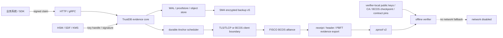

# TrustDB 国产密码威胁模型与合规证据映射

> 文档编号：`TDB-CN-TM-001`
>
> 版本：`0.1.0`
>
> 日期：`2026-07-23`
>
> 状态：Foundation engineering baseline
>
> 关联 Issue：[#444](https://github.com/wowtrust/trustdb/issues/444)
>
> 上位基线：[`TDB-CN-CM-001`](CHINA_COMPLIANCE_SCOPE_AND_CONTROL_MATRIX.zh-CN.md)、[`ADR-0001`](ADR-0001-CRYPTOGRAPHIC-SUITES.zh-CN.md)、[`ADR-0002`](ADR-0002-CRYPTO-AGILITY-FORMATS.zh-CN.md)、[`ADR-0003`](ADR-0003-SM-CRYPTO-DEPENDENCIES-AND-VECTORS.zh-CN.md)、[`ADR-0004`](ADR-0004-PROVIDER-NEUTRAL-CRYPTO-CONTRACTS.zh-CN.md)

## 1. 结论先行

TrustDB 的核心安全目标不是“数据库里的某个字段显示 L5”，而是让验证者在完全断网时，使用自己持有的 trust roots，逐字节复算业务摘要、签名、Merkle path、Signed Tree Head、外部 Anchor 包含关系与终局性材料。

这意味着系统必须同时守住五条主线：

1. 私钥和高权限密钥操作留在明确、可审计的 HSM/SDF/KMS 边界内，provider 故障时禁止静默回退到软件私钥。
2. suite、格式、LogID、namespace、签名输入、SM2 user ID 和 Merkle domain 全部显式绑定，不能根据默认配置或字节长度猜测。
3. Global Log、WAL、proofstore、备份和 Anchor 调度只允许单调前进；回滚、同 TreeSize 异 root、旧 backup 恢复到错误 namespace 必须 fail closed。
4. FISCO BCOS 的交易包含、PBFT 终局性、validator membership、合约身份和 publisher 身份分别验证；“RPC 返回成功”或“交易在某个区块中”都不单独等于离线 L5。
5. 证据文件可以携带验证材料，但不能自行指定信任根。验证器不得访问网络补齐缺失材料，也不得把证据自带公钥、CA root、validator set 或 checkpoint 自动变成可信输入。

本文是产品威胁建模和测评证据规划基线，不替代部署方对实际网络区域、人员、数据、HSM/KMS、CA、BCOS 联盟、供应商和运维流程开展的风险评估。

## 2. 范围、假设与非目标

### 2.1 范围内

- Server、CLI、Go SDK、Desktop 和离线 verifier；
- claim、receipt、batch、Global Log、STH、proof、record ID 和 key registry；
- WAL、file/Pebble/TiKV proofstore、object store、Anchor scheduler、逻辑备份与恢复；
- SM2/SM3/SM4、证书、TLS/mTLS、TLCP gateway、PKCS#11、SDF/HSM/KMS provider；
- FISCO BCOS endpoint、账户、合约、交易、回执、区块头、PBFT 签名、validator checkpoint 和成员变更；
- 管理员、构建环境、依赖、发布制品、SBOM、镜像与境内离线制品库。

### 2.2 基线假设

- 攻击者可以控制业务输入、网络路径、某个存储副本、单个 RPC endpoint 或普通运行账户；
- 攻击者可能窃取备份、获得管理员权限、诱导错误恢复、替换依赖或控制部分 BCOS validator；
- HSM/KMS、CA、TLCP gateway、BCOS 联盟和操作系统不是天然可信，必须用本地配置、产品材料、审计记录和交叉验证限定其信任范围；
- 本地 verifier 主机、其 trust-root 配置和验证软件供应链属于验证者必须单独保护的根边界；
- 算法本身按标准与选定实现工作，但调用参数、编码、状态机、密钥生命周期和供应链仍可能出错。

### 2.3 非目标

- 证明业务陈述在现实世界中为真；TrustDB 证明的是给定主体对给定字节的签名、系统处理轨迹和证据完整性；
- 在没有部署边界、正式报告和有效期的情况下宣称已经通过等保、密评、产品认证或司法审查；
- 用开源 SM2/SM3/SM4 实现替代依法或依方案需要的经检测认证密码产品；
- 让一个 proof 同时跨越未知 suite、未知格式、未认证 validator 变更或未固定合约升级。

## 3. 资产与安全目标

| 资产 | 主要安全目标 | 失陷后果 | 权威来源 |
| --- | --- | --- | --- |
| 客户端、服务端、STH、Anchor publisher 私钥 | 不可导出、用途隔离、可轮换/撤销、操作可审计 | 伪造 claim、receipt、STH 或链上发布 | HSM/SDF/KMS key handle、key registry、证书与密钥仪式 |
| 备份 DEK/KEK | 机密性、用途绑定、轮换、双人控制 | 备份明文泄露或攻击者构造可解密伪包 | HSM/KMS、SM4 envelope header 与审计事件 |
| 验证者 trust roots | 完整性、来源认证、版本与有效期 | 伪造证据被当作可信 | verifier 本地只读配置、受控 checkpoint/CA/public-key distribution |
| Suite/format/LogID/namespace marker | 不可变、显式、全链路一致 | 算法混淆、跨日志重放、旧格式误读 | V2/V5 durable marker 与对象 authenticated fields |
| WAL、proofstore、Global Log 与 STH | 完整性、单调性、抗回滚、可恢复 | 丢记录、重写历史、split view、错误 proof | durable state、signed STH、consistency proof、checkpoint |
| Anchor schedule 与 result | InFlight 不可替换、幂等、精确绑定 STH | 重复/错误上链、把其他 root 当作 L5 | durable schedule、immutable result、latest reference |
| `.sproof` / BCOS evidence bundle | 完整、自包含验证材料、不能自授信 | 在线依赖、错误 L5、无法长期复核 | versioned file、local trust config、offline verifier |
| 逻辑备份与恢复状态 | 机密性、完整性、版本/suite 绑定、恢复单调 | 数据泄露、回滚、跨 namespace 污染 | backup v5 manifest/entries、restore report、HSM/KMS |
| TLS/TLCP 证书与 gateway | endpoint 身份、机密性、双向认证、可轮换 | 中间人、endpoint substitution、明文暴露 | CA/trust store、gateway config、packet capture、audit |
| BCOS 合约、publisher、validator set | 身份固定、授权、包含与终局性可验证 | 锚定到错误合约/链、伪 finality | chain/group/contract pin、receipt proof、header、PBFT quorum、checkpoint |
| 管理配置、审计与时间源 | 最小权限、分权、不可抵赖、可靠时间 | 隐蔽降级、删除告警、夸大时间语义 | RBAC、immutable audit、trusted-time status、change approval |
| 源码、依赖、CI、镜像、发布制品 | 来源、完整性、可复现、可追溯 | 构建后门、算法替换、制品投毒 | pinned modules、SBOM、provenance、签名、受控镜像 |

## 4. 攻击者与信任边界

### 4.1 攻击者模型

| 攻击者 | 能力 | 默认不授予的能力 |
| --- | --- | --- |
| 恶意调用方/租户 | 构造任意 API 输入、重放请求、并发压测、提交合法或非法签名 | 读取其他租户密钥、修改 durable marker |
| 网络攻击者 | DNS/IP 劫持、MITM、阻断、重放、延迟或乱序流量 | 突破正确配置的双向认证和本地 trust pin |
| 被攻陷的普通节点或单个 RPC endpoint | 返回旧/伪状态、隐藏交易、制造 unknown outcome | 伪造达到阈值的 PBFT 签名或本地 verifier trust root |
| 存储/备份介质攻击者 | 删除、替换、回滚、复制文件，窃取 archive | 生成有效签名或解开 HSM/KMS 内 KEK |
| 高权限管理员 | 修改配置、启动/停止服务、发起恢复或密钥操作 | 绕过强制分权、不可变外部审计和 HSM policy |
| 供应链攻击者 | 替换 module、Action、镜像、编译器、native library 或发布包 | 同时控制独立签名/provenance、受控镜像与复核者 |
| 部分 BCOS validator 或联盟成员 | 审查交易、返回分叉、签署恶意提案 | 在未达到信任阈值时制造合法 quorum finality |

### 4.2 边界图



每条箭头都是需要认证、版本绑定、大小限制、错误语义和审计的接口。共享同一台主机不消除边界；gateway、sidecar、本地 Unix socket 和进程内 provider 仍必须明确谁提供身份、谁持有私钥、谁可以改变返回值。

## 5. 不可破坏的安全不变量

| ID | 不变量 | 失败时必须发生什么 |
| --- | --- | --- |
| `INV-01` | 同一对象图中的 suite、format、LogID、NodeID 和 namespace 精确一致 | 拒绝读取、写入、恢复或验证 |
| `INV-02` | 同 TreeSize 只能对应一个 RootHash；历史 STH 和 anchor result 不可覆盖 | 进入安全故障并产生审计告警 |
| `INV-03` | Anchor 的 TreeSize、RootHash、NodeID、LogID、suite 与证据引用的 STH 精确相等 | L5 验证失败；禁止用 `>=` 关系放宽 |
| `INV-04` | 一旦外部提交可能产生副作用，InFlight payload 不可替换 | 查询/重试同一 payload，不能用更新 root 覆盖 |
| `INV-05` | 私钥 provider 不可用、算法不匹配或 capability 不足时禁止软件回退 | 对应操作失败并告警 |
| `INV-06` | 证据文件内的 key、CA root、validator set、checkpoint 和 contract 不能自动成为 trust root | 要求验证者本地显式配置 |
| `INV-07` | BCOS transaction/receipt inclusion 与 PBFT finality 是两个独立验证阶段 | 任一缺失时不得输出离线 L5 |
| `INV-08` | verifier 完整性验证不访问服务器、CA、OCSP、BCOS、DNS 或 provider | 材料不足即失败，不在线补齐 |
| `INV-09` | 恢复只接受精确 V2/V5、匹配 suite 的完整 backup，并写入空 namespace | 旧格式、未知 entry、跨 suite 或非空目标失败 |
| `INV-10` | record index、latest anchor reference、L5 checkpoint 是派生状态 | 可重建但不得反向改变权威 evidence |
| `INV-11` | 区块时间、系统时间、可信时间戳和证据生成时间分别表达 | 禁止把区块时间宣传为法定可信时间 |
| `INV-12` | release 使用固定依赖、可复现输入、SBOM、provenance 和签名 | 来源或校验不明的制品不得进入中国生产 Profile |

## 6. 禁止的信任捷径

以下行为必须在代码、配置评审、部署手册和测试中明确禁止：

1. 根据 digest 长度、公钥长度、证书 OID、文件扩展名或当前配置推断 suite。
2. 把 `.sproof` 自带 server public key、root certificate、validator set、checkpoint 或 contract address 直接加入信任。
3. 在离线验证缺材料时访问 TrustDB、CA/OCSP/CRL、BCOS RPC、DNS、HSM/KMS 或公共网络补齐。
4. 只看 `proof_level=L5`、record index 或 API 标签，不复算 proof、STH 和 anchor/finality material。
5. 用 `anchor.TreeSize >= proof.TreeSize` 替代对同一 covering STH 的精确绑定。
6. 把 BCOS transaction hash、RPC receipt、block inclusion 或单个 endpoint 的 `latest` 响应单独当作 PBFT finality。
7. 把 BCOS endpoint 返回的 validator set 用来验证同一 endpoint 返回的 header，而没有本地 checkpoint 或认证的成员变更链。
8. 在提交超时后改用更新的 STH 覆盖旧 InFlight，或不查询状态就生成不同 payload 重试。
9. HSM/SDF/KMS/provider 出错时使用本地软件私钥继续生产签名。
10. 恢复时跳过 suite/format/LogID marker、把旧 backup 写入正在运行的 namespace，或删除 checkpoint 伪造“首次启动”。
11. 把开源国密库、TLS/TLCP 握手成功、写入联盟链或通过单项测试宣传为已经通过密评/认证。
12. 把 BCOS block time、应用服务器时间或未验证的文件时间作为独立可信时间结论。

## 7. 高风险威胁登记册

控制状态使用三个标签：`Existing` 表示当前主线已有可复核实现，`Decision` 表示 ADR/威胁模型已经固定但代码尚未完成，`Planned` 表示由所列 Issue 交付。一个威胁只有在全部必要控制和测试完成后才能关闭，不能把设计决策写成已实现能力。

### `TM-KEY-01`：签名密钥或 KEK 被窃取/滥用

- **风险**：Critical。攻击者可伪造 claim、receipt、STH、Anchor publisher 操作，或解密备份。
- **攻击路径**：软件私钥明文落盘、provider 权限过宽、密钥用途未隔离、管理员单人导出、日志泄露、HSM/KMS 凭据失陷。
- **控制**：`Existing`：provider-neutral non-exportable key handle、suite/算法/编码/KeyID 绑定、capability gate 和禁止软件回退；`Planned`：真实 HSM/SDF/KMS provider policy、双人审批、轮换/撤销和不可变审计。软件 adapter 仍在进程内持有私钥，不属于硬件保护。
- **Owner**：Security & Cryptography；Platform / SRE；部署方 Key Administrator。
- **验证与证据**：provider contract negative tests、导出拒绝、错误算法/用途拒绝、轮换/撤销演练、密钥仪式、设备/服务材料、审计事件。
- **Gate / Issues**：`G3`、`G5`、`G7`；#445、#449–#453、#475、#476、#481、#488。
- **残余风险**：已授权密钥在失陷到撤销之间生成的签名可能仍通过纯密码验证，必须结合签名时 key status、可信时间、事件响应和业务来源判断。

### `TM-STATE-01`：WAL、proofstore、Global Log 或恢复点回滚

- **风险**：Critical。旧状态可能隐藏已接受记录、重用 sequence/nonce、降低 TreeSize 或使新旧节点产生不同历史。
- **攻击路径**：替换数据目录、恢复旧快照、复制旧 Pebble/TiKV namespace、删除 checkpoint/marker、只恢复部分 WAL。
- **控制**：`Existing`：连续 WAL checkpoint、单调 TreeSize/generation 和恢复完整性基础；`Decision`：V2/V5 只恢复到空 namespace，旧 V1/V4 在切换后明确 unsupported；`Planned`：suite/format/LogID durable marker、backup lineage 和独立 audit 检测。
- **Owner**：Engineering；Platform / SRE；Deployment Owner。
- **验证与证据**：file/Pebble/TiKV contract tests、截断/部分恢复/旧 marker 负向测试、restore report、灾备演练、前后 STH 与 checkpoint 对比。
- **Gate / Issues**：`G1`、`G2`、`G5`；#446、#454、#473、#476、#481、#482。
- **残余风险**：若攻击者同时控制全部本地副本、外部审计和验证者保存的 checkpoint，纯本地状态无法证明发生过回滚；部署必须保留独立 checkpoint/anchor/audit 副本。

### `TM-LOG-01`：Global Log equivocation / split view

- **风险**：Critical。同一 TreeSize 的不同 root 或对不同客户端展示不一致历史，会破坏透明日志语义。
- **攻击路径**：签名服务或存储被控制、跨 namespace 混写、不同 endpoint 被错误当作同一 LogID、STH 缺少 consistency 验证。
- **控制**：`Existing`：STH/consistency proof、Anchor 精确 TreeSize/RootHash 绑定，NodeID/LogID 在双方非空时比较，多 endpoint 不自动组成同一日志；`Decision`：同 TreeSize 异 root fail closed；`Planned`：V2 强制非空 NodeID/LogID/suite 精确绑定，以及客户端 checkpoint 分发和告警流程。
- **Owner**：Engineering；Security & Cryptography；Local Evidence Verifier。
- **验证与证据**：equivocation golden tests、相同 TreeSize 异 root、错误 LogID/NodeID、错误 consistency path、跨 endpoint checkpoint tabletop。
- **Gate / Issues**：`G2`、`G4`；#454、#455、#460、#476、#481。
- **残余风险**：没有 checkpoint gossip 或独立观察者时，长期隔离的两个验证者可能无法及时发现定向 split view；部署手册必须要求 checkpoint 受控分发和比对。

### `TM-BACKUP-01`：备份被窃取、篡改或恢复到错误边界

- **风险**：Critical。攻击者可能读取业务元数据和证据、回滚状态、注入跨 suite 数据或利用恢复权限扩大影响。
- **攻击路径**：未加密 archive、KEK 与备份同处、manifest/entry 宽松解析、目标 namespace 非空、恢复 checkpoint 被替换。
- **控制**：`Existing`：当前逻辑备份具备完整性、大小限制和可恢复 checkpoint；`Decision`：backup v5 使用 SM4-GCM，AAD 绑定 suite/object/tenant/KeyID/context；`Planned`：KEK 位于 HSM/KMS、严格 entry allowlist、空 namespace/marker 匹配和无私钥导出 Gate。
- **Owner**：Platform / SRE；Security & Cryptography；Backup Operator。
- **验证与证据**：偷取介质 tabletop、错误 KEK/AAD/tag、未知 entry、截断 archive、跨 suite、非空目标、断点恢复和 RPO/RTO 演练。
- **Gate / Issues**：`G3`、`G5`；#451、#473、#474、#475、#481、#482。
- **残余风险**：加密不能隐藏 archive 大小、时间和访问模式；已解密恢复环境仍需主机、管理员和数据访问控制。

### `TM-ANCHOR-01`：BCOS 提交结果未知并导致重复或错误锚定

- **风险**：High。请求超时可能发生在交易已提交之后；替换 payload 重试会产生多个不可解释锚点或错误 latest 引用。
- **攻击路径**：提交后连接断开、RPC 返回超时、节点重启、落本地 result 前崩溃、nonce/sequence 处理错误。
- **控制**：`Existing`：通用 Anchor scheduler 在首次可能产生副作用后冻结 InFlight，并以同一 STH 重试、原子保存 immutable result、单调推进 latest reference；`Planned`：BCOS 稳定 anchor ID、查询 receipt/contract state、合约同 ID 异 payload 拒绝和多 endpoint reconciliation。
- **Owner**：Engineering；External Crypto & BCOS Operators。
- **验证与证据**：submit-success-before-local-complete crash test、重复完成、同 ID 异 payload、永久/临时错误、多个 endpoint 分歧、交易/回执/contract event。
- **Gate / Issues**：`G4`、`G5`；#462–#465、#470、#471、#481。
- **残余风险**：联盟治理执行链重置、合约紧急升级，或所有 endpoint 与本地信任状态分歧/隔离时，客户端只能停在“结果未知”，不能为了可用性伪造成功。

### `TM-BCOS-01`：endpoint、chain/group、合约或 publisher 身份被替换

- **风险**：Critical。格式正确的 receipt 可能来自错误链、错误 group、仿冒合约或未授权账户。
- **攻击路径**：DNS/RPC 劫持、错误配置、同地址不同链、代理篡改、合约 redeploy、publisher role 被授予攻击者。
- **控制**：`Decision`：本地 pin chain ID、group ID、genesis/checkpoint、contract address/code hash/version、event signature 和 publisher role；`Planned`：TLS/TLCP/mTLS、多 endpoint quorum read、配置变更审批与审计。BCOS 实现尚未进入主线。
- **Owner**：Security & Cryptography；Platform / SRE；External Crypto & BCOS Operators。
- **验证与证据**：错误 endpoint/chain/group/contract/code hash/publisher 负向测试、证书轮换、抓包、合约部署记录、role event、quorum-read 分歧测试。
- **Gate / Issues**：`G3`、`G4`、`G5`；#458、#459、#461–#464、#470、#471、#476。
- **残余风险**：如果联盟治理合法但恶意地更新合约或角色，本地旧 pin 会拒绝服务；接受新治理必须是显式、可审计的 trust-root 变更。

### `TM-BCOS-02`：把 transaction inclusion 错当 PBFT finality

- **风险**：Critical。Merkle proof 只能说明交易属于给定 block/receipt root，不能单独证明该 block 已被可信 validator quorum 最终确认。
- **攻击路径**：只导出 tx hash/receipt、信任单节点 header、忽略 PBFT signatures、把 `latest` block 当 finalized。
- **控制**：`Decision`：离线 verifier 分阶段输出 receipt inclusion 与 PBFT finality，block header 由本地 validator checkpoint 验签，任一阶段缺失不得输出 L5；`Planned`：BCOS evidence schema、receipt proof 和 PBFT verifier。
- **Owner**：Security & Cryptography；Local Evidence Verifier；External Crypto & BCOS Operators。
- **验证与证据**：篡改 transaction/receipt path/header/signature、签名不足/重复/非成员、错误 block number/hash；断网验证报告分别列出两个 stage。
- **Gate / Issues**：`G4`；#465–#468、#471、#481。
- **残余风险**：PBFT finality 证明依赖本地 checkpoint 的正确来源和信任阈值；验证器不能证明 checkpoint 之前的联盟治理本身合理。

### `TM-BCOS-03`：validator rotation 未认证或跨变更证明

- **风险**：Critical。使用新区块自带 validator set 验证自己会形成循环信任；使用过期集合会错误接受或拒绝 proof。
- **攻击路径**：证据跨成员变更、伪造变更事件、跳过中间 epoch、阈值或权重计算错误。
- **控制**：`Decision`：MVP 只接受静态本地 validator checkpoint，proof 跨变更立即失败；`Planned`：从可信 checkpoint 开始、每一步由前一集合认证、连续且无缺口的 transition chain。
- **Owner**：Security & Cryptography；External Crypto & BCOS Operators；Local Evidence Verifier。
- **验证与证据**：跨 epoch 拒绝、缺失/乱序/重复 transition、错误阈值、撤销 validator 签名、静态与轮换四节点 integration evidence。
- **Gate / Issues**：`G4`；#467、#469、#471、#481。
- **残余风险**：联盟在 checkpoint 分发渠道之外进行治理变更时，离线 verifier 应停止验证而不是自动追随网络。

### `TM-VERIFY-01`：证据文件自授信或在线补齐材料

- **风险**：Critical。攻击者可把伪造 public key、CA root、contract pin 或 validator set 与伪证据一起封装，使“自洽”被误判为“可信”。
- **攻击路径**：verifier 自动导入 evidence trust material、缺失证书状态时访问网络、SDK 使用服务器返回的 key 立即验证服务器签名。
- **控制**：`Existing`：当前 `.sproof` verifier 使用调用方提供的 server public key 并可完全离线验证现有 L1–L5；`Decision`：V2 evidence 内材料只作为从本地 root 向下验证的候选链；`Planned`：统一 trust package、BCOS/CA checkpoint、禁网 Gate 和 trust-config digest 输出。
- **Owner**：Security & Cryptography；Local Evidence Verifier；SDK & Clients。
- **验证与证据**：完全断网测试、网络 syscall/HTTP mock 拒绝、替换 evidence key/root/checkpoint、空 trust config、错误 trust-config digest。
- **Gate / Issues**：`G2`、`G4`；#455–#457、#460、#462、#466–#469、#481。
- **残余风险**：离线 verifier 无法自动获知导出之后的新撤销或治理变化；验证者必须按制度更新本地 trust package 并保留历史版本。

### `TM-TRANSPORT-01`：TLS/TLCP gateway、证书或内部明文边界失陷

- **风险**：High。攻击者可冒充 endpoint、读取/修改 claim、替换响应，或在 gateway 后的未保护链路继续攻击。
- **攻击路径**：关闭证书校验、错误 CA、过期/吊销证书、双证书混用、gateway 到 backend 明文跨不可信网络、native library 投毒。
- **控制**：`Decision`：TLS/mTLS baseline、TLCP gateway 独立最小权限和固定 Tongsuo/GmSSL 边界；`Planned`：证书用途/链/状态/hostname 校验、gateway-backend 再认证、轮换和失效演练。
- **Owner**：Platform / SRE；Security & Cryptography；External Crypto Operators。
- **验证与证据**：握手负向矩阵、错误 CA/hostname/用途、过期/吊销、双证书交换、抓包证明、gateway crash/failover、SBOM 与镜像 digest。
- **Gate / Issues**：`G3`、`G5`；#458、#459、#471、#478、#479、#481。
- **残余风险**：传输认证不证明业务调用者有租户权限，也不保护已进入 endpoint 内存的明文；仍需 RBAC、主机隔离和数据最小化。

### `TM-ADMIN-01`：高权限管理员单点滥用或审计被删除

- **风险**：Critical。管理员可切换配置、恢复旧数据、替换 trust pin、授予 publisher、关闭告警或销毁证据。
- **攻击路径**：共享 root 账户、无 MFA/堡垒机、职责未分离、应用日志代替安全审计、审计与业务数据同权存储。
- **控制**：`Decision`：viewer/operator/security-auditor/key-admin 分权和关键操作双人审批；`Planned`：不可变签名/hash-chain audit、可信时间状态、启动 policy、独立日志汇聚与告警。
- **Owner**：Platform / SRE；Deployment Owner；Security & Cryptography。
- **验证与证据**：权限矩阵、越权负向测试、双人审批、账号禁用、审计删除/重排检测、时间回拨、配置 diff 与堡垒机记录。
- **Gate / Issues**：`G3`、`G5`、`G6`；#475–#477、#481–#485。
- **残余风险**：部署方若同时把主机、HSM、审计和备份控制权交给同一人员，产品内 RBAC 无法补偿组织级职责失效。

### `TM-SUPPLY-01`：依赖、构建、Action、native library 或发布制品投毒

- **风险**：Critical。后门可窃取私钥、改变 hash/signature、伪造验证结果或仅在特定架构触发。
- **攻击路径**：浮动 tag、恶意上游 release、GitHub Action 供应链、未固定容器、关闭 module checksum、境内镜像内容漂移、构建机被控。
- **控制**：`Existing`：gmsm 精确 version/commit/sum、无未提交 `replace`、国密 golden vectors、独立 OpenSSL/LibreSSL oracle 和 release SBOM 基础；`Planned`：最小权限 CI、provenance、制品签名、clean-room rebuild、境内镜像 digest 对照和双架构 qualification。
- **Owner**：Release Engineering；Security & Cryptography；Supplier。
- **验证与证据**：`go mod verify`、dependency diff、Action/容器 digest、SBOM diff、签名验证、clean-room rebuild、amd64/arm64 比对、漏洞响应记录。
- **Gate / Issues**：`G2`、`G5`、`G7`；#443、#460、#471、#478、#479、#481、#488。
- **残余风险**：可复现构建不能证明源代码无恶意逻辑；仍需要代码评审、威胁测试、上游治理判断和独立制品验证。

### `TM-TIME-01`：把本地时间或 BCOS block time 夸大为可信时间

- **风险**：High。验证者可能错误推断证据在某个法律相关时刻已存在。
- **攻击路径**：主机时钟回拨、validator 提议不准确时间、文档把“上链时间”写成“可信时间戳”。
- **控制**：`Existing`：当前架构区分 STH、Anchor 和 sink-specific 时间语义；`Decision`：BCOS block time 不等于可信时间；`Planned`：分别建模时间字段、记录时间源状态/漂移，并只让经验证的独立时间证明增加对应语义。
- **Owner**：Security & Cryptography；Platform / SRE；Product Owner。
- **验证与证据**：时钟回拨/漂移测试、字段来源检查、时间戳 proof、claims review、运维时间源配置。
- **Gate / Issues**：`G4`、`G5`、`G6`；#462、#465、#476、#481、#482、#486。
- **残余风险**：联盟链共识时间提供的是联盟规则下的区块时间，不自动等同于法定可信时间服务。

### `TM-AVAIL-01`：HSM/KMS、TLCP gateway 或 BCOS 长期不可用

- **风险**：High。系统可能积压、重复提交、阻塞 L1–L4，或为恢复服务而绕过密码边界。
- **攻击路径**：外部 provider 故障、证书过期、BCOS 分区、endpoint 全部返回分歧、限流和资源耗尽。
- **控制**：`Existing`：L1–L4 与外部 Anchor 解耦、mutable Anchor 状态有界、同一 InFlight 退避重试；`Decision`：provider 不可用时 fail closed；`Planned`：BCOS 多 endpoint 只对可重试错误切换，以及容量、告警和灾备演练。
- **Owner**：Engineering；Platform / SRE；External Crypto & BCOS Operators。
- **验证与证据**：长期不可用、半开连接、超时、限流、磁盘满、证书过期、恢复后幂等续跑、backlog 与 SLO 报告。
- **Gate / Issues**：`G4`、`G5`；#470、#477、#480–#482。
- **残余风险**：安全边界优先于可用性；当所有可信 provider 或 endpoint 不可用时，中国生产 Profile 可以停止生成新签名/L5，但不能切换到未批准路径。

## 8. Tabletop walkthrough

每次 Foundation/CN_SM_V1/BCOS/GA 安全评审至少走查以下场景。结果必须记录参与者、日期、部署/commit、观察、决策、Owner 和整改 Issue。

| 场景 | 注入条件 | 预期系统反应 | 必须收集的证据 |
| --- | --- | --- | --- |
| 密钥失陷 | 宣布 STH signer key 在时间 T 可能泄露 | 停止使用、撤销/轮换、保留历史 key status；不得重签历史 | key event、审计、事件时间线、受影响证据范围 |
| 状态回滚 | 用较旧 proofstore/backup 替换当前目录 | marker/checkpoint/TreeSize 检测并拒绝启动或恢复 | 错误码、前后 marker/STH、恢复报告、告警 |
| Equivocation | 提供相同 TreeSize、不同 RootHash 的 STH | fail closed，保存冲突材料并告警 | 两份 signed STH、key/LogID、验证日志 |
| Unknown transaction | BCOS 接受交易后断开连接 | 保持同一 InFlight，查询后以同 payload 续跑 | anchor ID、payload digest、tx/receipt/contract state |
| Validator rotation | proof 跨越未提供 transition 的 epoch | 停在 finality stage 并拒绝 L5 | 本地 checkpoint、header、缺失 transition 诊断 |
| 备份被盗 | 攻击者取得完整 `.tdbackup` | 无 KEK 不能解密；无私钥可提取；记录介质事件 | envelope header、key reference、泄露字段清单 |
| Endpoint substitution | DNS 指向另一 BCOS chain/group | TLS/pin/quorum 或 chain/group/contract 检查失败 | cert、endpoint、chain/group、contract/code hash diff |
| 供应链投毒 | 替换 gmsm module 或 release binary | checksum/signature/SBOM/vector/rebuild gate 失败 | module sum、provenance、SBOM diff、vector failure |

## 9. 合规证据映射

证据包只收集“能被复核的事实”，不把计划、截图或自我声明当作已实现控制。每份材料应记录 `evidence_id`、control/threat ID、部署/commit、生成工具版本、时间、Owner、完整性摘要、保密级别、有效期和替代关系。

| Evidence family | 覆盖威胁/控制 | 最小材料 | Producer / Owner | Gate / Issues |
| --- | --- | --- | --- | --- |
| `crypto-design` | `TM-KEY-01`、`TM-LOG-01`、`CRY-01`–`CRY-04` | ADR、suite/format registry snapshot、SM vectors、golden digest、评审记录 | Security & Cryptography | `G1` `G2`；#441–#445、#460 |
| `provider-and-key-custody` | `TM-KEY-01`、`CRY-05`–`CRY-07`、`IAM-03` | provider contract results、public descriptor、key ceremony、role/policy、rotation/revocation、产品材料 | Security & Cryptography + Platform / SRE | `G3` `G7`；#449–#453、#475、#488 |
| `proof-and-offline-verification` | `TM-LOG-01`、`TM-VERIFY-01`、`EVD-01`–`EVD-04` | canonical files、断网验证日志、tamper matrix、local trust-config digest、跨组件结果 | Engineering + Local Evidence Verifier | `G2`；#454–#457、#460、#481 |
| `storage-rollback-and-recovery` | `TM-STATE-01`、`OPS-05` | backend contract tests、marker/checkpoint、crash/replay、restore report、RPO/RTO | Engineering + Platform / SRE | `G1` `G5`；#446、#473、#481、#482 |
| `backup-confidentiality` | `TM-BACKUP-01`、`CRY-04`、`DATA-03`–`DATA-05` | backup v5 manifest、SM4 envelope params、KEK reference、wrong-key/tamper tests、field inventory | Security & Cryptography + Data Controller / Legal | `G3` `G5`；#451、#473、#474、#481 |
| `transport-and-certificates` | `TM-TRANSPORT-01`、`TM-BCOS-01`、`IAM-04`、`CRY-07`–`CRY-08` | TLS/TLCP config、certificate chain/status、packet capture、rotation/failure report、gateway SBOM | Platform / SRE | `G3` `G5`；#458、#459、#471、#479 |
| `bcos-anchor-and-finality` | `TM-ANCHOR-01`、`TM-BCOS-01`–`03`、`EVD-05`–`EVD-07` | compatibility pin、contract source/code hash/deploy tx、publisher roles、receipt proof、header、PBFT signatures、checkpoint/transitions | External Crypto & BCOS Operators + Local Evidence Verifier | `G4`；#461–#472、#481 |
| `administration-and-audit` | `TM-ADMIN-01`、`TM-TIME-01`、`IAM-01`–`IAM-03`、`OPS-01`–`OPS-04` | RBAC matrix、approval、immutable audit samples、time-source status、config change、alert drill | Platform / SRE + Deployment Owner | `G5` `G6`；#475–#477、#482–#485 |
| `supply-chain` | `TM-SUPPLY-01`、`OPS-07`–`OPS-09` | pinned dependency list、SBOM、provenance、artifact signatures、rebuild comparison、domestic mirror digest、vulnerability record | Release Engineering + Supplier | `G5` `G7`；#443、#478、#479、#488 |
| `availability-and-performance` | `TM-AVAIL-01`、`OPS-06`、`OPS-10` | backlog/SLO、provider outage、BCOS partition、capacity/benchmark、recovery result | Engineering + Platform / SRE | `G4` `G5`；#470、#480、#481 |
| `assessment-and-claims` | 全部高风险威胁、`ASS-01`–`ASS-05` | risk register、密码应用方案、evidence index、预评估整改、claims approval、正式报告/证书 | Deployment Owner + qualified external roles | `G6` `G7`；#483–#488 |

建议目录结构：

```text
compliance-evidence/
  manifest.cbor
  threat-model-and-risk-register/
  crypto-design-and-vectors/
  provider-and-key-custody/
  offline-proof-and-bcos-finality/
  storage-backup-and-dr/
  transport-certificates-and-audit/
  supply-chain-and-platform/
  performance-and-security-tests/
  assessments-certificates-and-claims/
```

公开仓库只能保存模板、测试向量和脱敏样例。生产私钥、KEK、HSM/KMS 凭据、真实个人信息、联盟内部拓扑、未公开漏洞和高权限操作记录不得进入公开证据目录。

## 10. 可直接引用的残余风险说明

以下文本可以进入 Project README、部署手册、密码应用方案或交付边界说明，但必须保留限定条件：

1. **证据真实性边界**：TrustDB 可以证明给定 key 对给定字节的签名、记录进入透明日志的路径以及外部 Anchor 材料是否在本地 trust roots 下成立；它不自动证明业务陈述在现实世界中为真，也不替代提交方身份核验和取证流程。
2. **密钥失陷边界**：若一个当时被信任的签名密钥在撤销前已失陷，单纯密码验签仍可能成功。验证结论必须结合 key status、可信时间、事件响应记录和业务来源。
3. **离线信任边界**：`.sproof` 可以携带完整验证材料，但不会自带可信结论。server public key、CA root、BCOS checkpoint、validator set 和 contract pin 必须由验证者从本地受控渠道提供。
4. **BCOS L5 边界**：交易或回执包含证明不等于 PBFT 终局性。离线 L5 同时依赖精确 Anchor 事件、可信 block header、足够的 validator quorum、正确 membership 和本地 checkpoint。
5. **时间边界**：STH 时间、应用时间、BCOS block time 和独立可信时间戳含义不同。TrustDB 只报告实际验证到的时间材料，不把普通区块时间宣传为法定可信时间。
6. **备份边界**：SM4-GCM 可以保护备份内容的机密性与完整性，但不能隐藏文件大小、创建时间和访问模式；恢复后的明文仍依赖主机、管理员和数据访问控制。
7. **开源实现边界**：开源 SM2/SM3/SM4 实现用于互操作和软件验证，不自动构成商用密码产品认证或具体部署的密评结论。生产私钥和 KEK 仍需进入经批准的密码边界。
8. **破坏性升级边界**：国产 V2/V5 采用停止服务、清空或移走旧数据、使用新 `LogID`/namespace 初始化的断代切换。新版不会自动读取或迁移旧 model/proof/WAL/API v1、proofstore v4 或 backup v4；逻辑备份能力继续由 backup v5 提供。

## 11. 维护与退出条件

以下变化必须更新本文、控制矩阵和相关 ADR，并重新执行 tabletop：

- suite、SM2 user ID、签名编码、Merkle domain、SM4 mode/AAD 或格式代际变化；
- 新增/替换 HSM、SDF、KMS、CA、TLCP gateway、BCOS network/contract/provider；
- validator membership、finality rule、trust checkpoint 或联盟治理变化；
- proof、Anchor、backup、WAL、proofstore 或 offline verifier 信任语义变化；
- 管理角色、审计、时间、数据分类、出境或发布供应链变化；
- 高风险漏洞、实际密钥/备份/endpoint 事件或外部评估发现。

Foundation Gate 的退出条件不是“所有风险消失”，而是每个 High/Critical 威胁都有明确 Owner、实现 Issue、fail-closed 行为、可重复测试、证据位置和不能由产品消除的残余风险说明。
